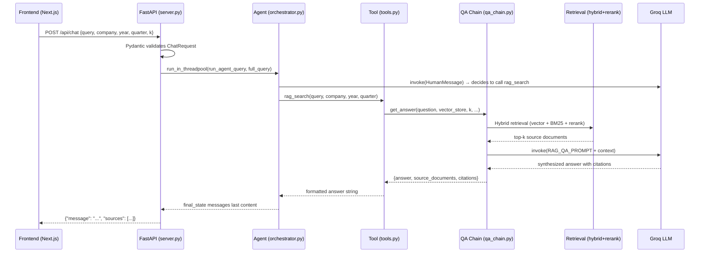

# FastAPI From AURA — 6-Day Mastery Plan
### *FastAPI Engineering Through the AURA Codebase*

> **AURA** = Agentic RAG Financial Intelligence Platform  
> **Project root**: `Finance_RAG_Project/`  
> **API entry point**: `src/api/server.py`

---

## Legend

| Symbol | Meaning |
|--------|---------|
| 🟢 | Present in AURA |
| 🟡 | Present but partially / could be improved |
| ⚪ | Not in AURA — general FastAPI concept |
| 🔴 | Potential architectural issue / improvement |

---

## 📅 6-Day Learning Plan

### Day 1 — HTTP + FastAPI Fundamentals
| Category | Detail |
|----------|--------|
| **Theory** | LEVEL 0–1 of this guide (HTTP, request lifecycle, `FastAPI()`, routes, path params, query params, bodies, status codes) |
| **AURA Files** | `src/api/server.py` (the entire file) |
| **Exercises** | Add `/health` endpoint; call `/api/kpis` via curl; inspect `422` errors |
| **Outcome** | Understand what every line in `server.py` does and why |

### Day 2 — Pydantic + Routers + Architecture
| Category | Detail |
|----------|--------|
| **Theory** | LEVEL 2–4 (Pydantic, project structure, APIRouter) |
| **AURA Files** | `server.py` (`ChatRequest`, `ReportRequest`); `src/agents/tools.py`; `src/extraction/schema.py` |
| **Exercises** | Add a new field to `ChatRequest`; send malformed JSON; create a new `APIRouter` |
| **Outcome** | Explain why Pydantic prevents bad data from entering your business logic |

### Day 3 — Async/Await + Dependencies + Request Lifecycle
| Category | Detail |
|----------|--------|
| **Theory** | LEVEL 5–7 (dependency injection, async, event loop) |
| **AURA Files** | `server.py` (`run_in_threadpool`, `StreamingResponse`); `src/agents/events.py` |
| **Exercises** | Convert a sync endpoint to async; add a `Depends()` logger dependency |
| **Outcome** | Explain *exactly* why AURA uses `run_in_threadpool` for the LangGraph agent |

### Day 4 — Database + Auth + Errors + Middleware
| Category | Detail |
|----------|--------|
| **Theory** | LEVEL 8–11 (exceptions, CORS, config, SQLAlchemy) |
| **AURA Files** | `src/extraction/schema.py`; `src/agents/tools.py` (DB session); `server.py` (CORSMiddleware) |
| **Exercises** | Add error handling to `/api/chat`; trigger a 422; add a `/api/status` endpoint |
| **Outcome** | Write a complete CRUD endpoint backed by SQLite |

### Day 5 — AI/ML + RAG + FastAPI
| Category | Detail |
|----------|--------|
| **Theory** | LEVEL 12–14 (AI models in APIs, RAG pipeline, SSE streaming) |
| **AURA Files** | `src/generation/qa_chain.py`; `src/agents/orchestrator.py`; `src/retrieval/vector_store.py`; `src/retrieval/hybrid_retriever.py` |
| **Exercises** | Add a `/api/retrieval-debug` endpoint; expose the embedding model count via API |
| **Outcome** | Explain the entire RAG chain to a non-technical person and trace each layer in code |

### Day 6 — Build + Debug + Refactor + Mock Hackathon
| Category | Detail |
|----------|--------|
| **Theory** | LEVEL 15–18 (auth, testing, docs, production thinking) |
| **AURA Files** | All files; `docker-compose.yml`; `backend.Dockerfile` |
| **Exercises** | Complete the Capstone challenge; read `/docs`; run the full server |
| **Outcome** | Build and explain a novel FastAPI endpoint in AURA from scratch |

---

# LEVEL 0 — Backend Mental Model

## What Is a Backend?

Think of AURA as a **professional research firm**.

```
You (User / Frontend)
        │
        │  "What were Apple's risks in Q3 2024?"
        ▼
   AURA Reception Desk  (FastAPI — src/api/server.py)
        │
        │  routes your question to the right department
        ▼
   Research Department  (LangGraph Agent — src/agents/orchestrator.py)
        │
        │  asks the filing librarian to retrieve documents
        ▼
   Filing Librarian  (RAG Pipeline — src/retrieval/ + src/generation/)
        │
        ├── ChromaDB (vector similarity search — data/chroma_db/)
        └── BM25 (keyword search — data/bm25_index/)
        │
        ▼
   Analyst  (Groq LLM — Qwen 3 32B via langchain_groq)
        │
        │  synthesizes an answer
        ▼
   Reception Desk sends typed report back to you
        │
        ▼
     You receive: {"message": "...", "sources": [...]}
```

**FastAPI is the reception desk.** It receives HTTP requests, validates them, routes them to the right internal system, and packages the results as HTTP responses. It does not do the intelligent work itself — it orchestrates.

---

# LEVEL 1 — HTTP Before FastAPI

## HTTP Request Anatomy

When the AURA frontend sends a question, it sends an **HTTP request**:

```
POST /api/chat  HTTP/1.1
Content-Type: application/json

{
  "query": "What was Apple's gross margin in Q3 2024?",
  "company": "Apple",
  "year": 2024,
  "quarter": "Q3",
  "k": 6
}
```

| Part | Meaning | AURA Example |
|------|---------|-------------|
| **Method** | What action to take | `POST` for chat, `GET` for KPIs |
| **URL** | Which resource/operation | `/api/chat`, `/api/kpis` |
| **Headers** | Metadata | `Content-Type: application/json` |
| **Query Params** | Filters after `?` | `/api/kpis?company=Apple&year=2024` |
| **Body** | The actual data | `ChatRequest` JSON |

### HTTP Methods

| Method | Meaning | AURA Example |
|--------|---------|-------------|
| `GET` | Read data | `GET /api/kpis` |
| `POST` | Create / trigger action | `POST /api/chat` |
| `PUT` | Replace entirely | ⚪ Not in AURA |
| `PATCH` | Partial update | ⚪ Not in AURA |
| `DELETE` | Remove | ⚪ Not in AURA |

## Status Codes

| Code | Meaning | When AURA Returns It |
|------|---------|---------------------|
| `200 OK` | Success | All normal responses |
| `201 Created` | Resource created | ⚪ Not used |
| `400 Bad Request` | Client sent wrong data | ⚪ Could add |
| `401 Unauthorized` | Not authenticated | ⚪ Auth not implemented |
| `404 Not Found` | Route doesn't exist | Hitting `/api/nonexistent` |
| `422 Unprocessable Entity` | Pydantic validation failed | Sending `query: 123` |
| `500 Internal Server Error` | Uncaught exception | LLM crashes |

### Why Does FastAPI Return `422`?

When a client sends a request body to `/api/chat`, FastAPI reads the JSON and tries to build a `ChatRequest` Pydantic model. If data doesn't match:

```python
# What AURA defines:
class ChatRequest(BaseModel):
    query: str  # MUST be a string

# What client accidentally sends:
{"query": 42}  # int, not string!
```

FastAPI **automatically** returns before your route function ever executes:
```json
{
  "detail": [
    {"loc": ["body", "query"], "msg": "str type expected", "type": "type_error.str"}
  ]
}
```

This is extremely powerful — your business logic never sees corrupted data.

---

# LEVEL 1 — FastAPI Fundamentals

## The FastAPI Application Object

```python
# src/api/server.py — Line 27
app = FastAPI(title="Finance RAG API", version="1.0.0")
```

**Analogy**: `FastAPI()` is like registering your company. Before you can open departments or answer phones, you need a legal entity. `FastAPI()` creates that entity.

- Registers the application with ASGI
- Creates an empty route table
- Sets up automatic JSON serialization
- Generates interactive docs at `/docs` and `/redoc`

## Route Decorators

```python
# src/api/server.py — Lines 56-58
@app.get("/")
def read_root():
    return {"status": "ok", "message": "Finance RAG API running"}
```

**Line-by-line:**

```
@app.get("/")
│    │    └── The URL path
│    └─────── The HTTP method: GET
└──────────── The FastAPI instance

def read_root():
└── A plain Python function — no base class needed

return {"status": "ok", "message": "Finance RAG API running"}
└── Return a dict → FastAPI serializes it to JSON automatically
└── Client receives: 200 OK + JSON body
```

### AURA's Endpoints

| Method | Path | Handler | Purpose |
|--------|------|---------|---------|
| `GET` | `/` | `read_root` | Health check |
| `GET` | `/api/workflow-stream` | `workflow_stream` | SSE agent monitoring |
| `POST` | `/api/chat` | `chat_endpoint` | Main AI chat |
| `GET` | `/api/kpis` | `get_kpis_endpoint` | Financial KPI dashboard |
| `POST` | `/api/generate-report` | `generate_report` | Investment report generation |

## Query Parameters in AURA

🟢 **src/api/server.py, line 134:**

```python
@app.get("/api/kpis")
async def get_kpis_endpoint(
    company: Optional[str] = None,    # query param
    year: Optional[int] = None,        # query param
    quarter: Optional[str] = None      # query param
):
```

These parse automatically from the URL:
```
GET /api/kpis?company=Apple&year=2024&quarter=Q3
```

If a parameter has a default (`= None`), it's optional. If no default, it's required.

---

# LEVEL 2 — Pydantic

## What Is Pydantic?

**Analogy**: Pydantic is the **security guard at AURA's reception desk**.

Every request tries to enter the building (API). The guard checks the visitor's ID form (JSON body):
- Every required field is present?
- Every field has the right type?
- Values are within valid ranges?

If anything is wrong, the guard sends them back (returns `422`) before they reach any internal department.

## ChatRequest Model

```python
# src/api/server.py — Lines 42-49
class ChatRequest(BaseModel):
    query: str
    company: Optional[str] = None
    year: Optional[int] = None
    quarter: Optional[str] = None
    section: Optional[str] = None
    k: Optional[int] = 6
    thread_id: Optional[str] = "default"
```

**Field-by-field explanation:**

```
query: str
└── Required. Type: string.
    If missing → 422.  If wrong type → 422.

company: Optional[str] = None
└── Optional. Default: None.
    Optional[str] == Union[str, None]
    Client can omit → becomes None → search all companies

k: Optional[int] = 6
└── Optional integer, default 6.
    Controls how many ChromaDB chunks to retrieve.
    Client can override: {"query": "...", "k": 12}

thread_id: Optional[str] = "default"
└── LangGraph MemorySaver thread identifier.
    Each unique thread_id has separate conversation memory.
```

## ReportRequest Model

```python
# src/api/server.py — Lines 51-54
class ReportRequest(BaseModel):
    company: str   # Required — no default
    year: int      # Required — no default
    quarter: str   # Required — no default
```

All three are **required**. Omitting any one → `422`.

## Pydantic Validation Lifecycle

```
Client sends JSON:
{"query": "Apple gross margin Q3 2024?", "company": "Apple", "year": 2024, "quarter": "Q3"}
         │
         ▼
FastAPI reads HTTP body (raw bytes → parsed JSON dict)
         │
         ▼
FastAPI calls: ChatRequest(**parsed_json)
         │
         ▼
Pydantic validates each field:
  ✓ query = "Apple..." → str ✓
  ✓ company = "Apple" → str ✓
  ✓ year = 2024 → int ✓
  ✓ k = 6 (default applied) ✓
  ✓ thread_id = "default" (default applied) ✓
         │
         ▼
Python object: ChatRequest instance
         │
         ▼
Your function: async def chat_endpoint(req: ChatRequest)
               req.query == "Apple gross margin Q3 2024?"
               req.company == "Apple"
               req.k == 6
```

### 🧠 Think Like a Backend Engineer

**Q: Why use `Optional[str] = None` instead of just `str`?**
A: Because not every chat request specifies a company filter. When the user asks "compare all three companies," they don't set `company`. `Optional` with `None` default means the business logic can detect "no filter was given" and search everything.

**Q: What happens if client sends `{"query": "", "k": -5}`?**
A: Pydantic accepts both — an empty string is still `str`, and `-5` is still `int`. To reject these, use `Field(min_length=1)` and `Field(ge=0)`. This is a 🔴 improvement opportunity in AURA.

**Q: Should I put business logic inside a Pydantic model?**
A: No. Pydantic validates shape and types only. Business logic belongs in service functions.

---

# LEVEL 3 — Project Structure

## AURA's Actual Directory Structure

```
Finance_RAG_Project/               ← Project root
│
├── .env                           ← API keys (GROQ_API_KEY) — gitignored
├── requirements.txt               ← Python dependencies
├── backend.Dockerfile             ← Container definition
├── docker-compose.yml             ← Multi-service orchestration
├── config/
│   └── config.yaml                ← Central non-secret config
│
├── src/                           ← All Python source code
│   ├── api/
│   │   └── server.py              ← THE ENTRY POINT
│   │
│   ├── agents/                    ← LangGraph AI orchestration
│   │   ├── orchestrator.py        ← Agent graph + run_agent_query()
│   │   ├── tools.py               ← LangChain tools (rag_search, get_kpis)
│   │   └── events.py              ← SSE event bus
│   │
│   ├── retrieval/                 ← RAG retrieval layer
│   │   ├── vector_store.py        ← ChromaDB wrapper (EarningsVectorStore)
│   │   ├── bm25_retriever.py      ← BM25 keyword search
│   │   ├── hybrid_retriever.py    ← Vector + BM25 via Reciprocal Rank Fusion
│   │   ├── reranker.py            ← Cross-encoder reranking
│   │   ├── router.py              ← Query routing strategy
│   │   └── query_transformer.py   ← Query rewriting + multi-query expansion
│   │
│   ├── generation/                ← LLM integration
│   │   ├── qa_chain.py            ← Main RAG chain (get_answer)
│   │   └── prompts.py             ← Prompt templates (RAG_QA_PROMPT)
│   │
│   ├── ingestion/                 ← Data ingestion pipeline
│   │   ├── pipeline.py            ← End-to-end ingestion orchestrator
│   │   ├── chunker.py             ← Text chunking (RCTS)
│   │   ├── embedder.py            ← HuggingFace embedding singleton
│   │   └── file_parser.py         ← Filename → metadata parsing
│   │
│   ├── extraction/                ← Structured data extraction
│   │   ├── schema.py              ← SQLAlchemy ORM model (EarningsKPI)
│   │   └── kpi_extractor.py       ← LLM-based KPI extraction
│   │
│   └── utils/
│       └── logger.py              ← Centralized logging
│
├── data/                          ← Runtime data (gitignored)
│   ├── chroma_db/                 ← ChromaDB persisted vectors
│   ├── bm25_index/                ← BM25 serialized index
│   └── finance_kpis.db            ← SQLite database
│
└── frontend/                      ← Next.js frontend
```

## What Problem Does Each Layer Solve?

| Layer | File(s) | Problem Solved |
|-------|---------|----------------|
| **API** | `src/api/server.py` | HTTP interface. No API = no external access |
| **Agents** | `src/agents/` | Intelligent orchestration — which tool to call, in what order |
| **Retrieval** | `src/retrieval/` | Finding relevant text chunks from 23 earnings transcripts |
| **Generation** | `src/generation/` | Synthesizing answers from context using an LLM |
| **Ingestion** | `src/ingestion/` | Converting raw txt files → searchable vector chunks |
| **Extraction** | `src/extraction/` | Converting unstructured text → structured KPI numbers |
| **Utils** | `src/utils/` | Shared infrastructure (logging) |

## Why Not Put Everything in `server.py`?

```python
# ❌ Anti-pattern: one giant file
@app.post("/api/chat")
async def chat_endpoint(req: ChatRequest):
    # Load embedding model...300 lines of code...
    # Build ChromaDB connection...
    # Run BM25 retrieval...
    # Combine with vector results...
    # Re-rank with cross-encoder...
    # Call Groq API...
    # Parse response...
    # Format citations...
    # (500+ lines in one function)
```

Problems:
1. **Untestable** — can't unit test individual steps
2. **Unreusable** — can't call the RAG logic from a CLI evaluation script
3. **Unmaintainable** — changing the LLM model requires searching route code
4. **Unreadable** — impossible to reason about

AURA's solution — **service layer pattern**:
```
HTTP layer (server.py)
    calls → Agent layer (orchestrator.py)
    calls → Tool layer (tools.py)
    calls → Retrieval layer (qa_chain.py)
    calls → Vector/BM25 layer
```

Each layer has a single responsibility.

---

# LEVEL 4 — APIRouter

## 🔴 AURA's Router Structure

🟡 AURA puts all routes directly in `server.py`. In a larger application, you'd use `APIRouter`:

**Analogy**: `APIRouter` is like **departments inside a company**. Instead of one CEO who answers every phone call, you have department heads.

```python
# ⚪ How to add a router (general FastAPI knowledge)
from fastapi import APIRouter

# Create: src/api/routers/health.py
health_router = APIRouter(prefix="/api", tags=["Health"])

@health_router.get("/health")
def health_check():
    return {"status": "healthy", "api": "Finance RAG API", "version": "1.0.0"}

# In server.py:
from src.api.routers.health import health_router
app.include_router(health_router)
# Now: GET /api/health is live
```

## What `app.include_router()` Does

1. Takes all routes on `health_router`
2. Applies the router's `prefix` to each route path
3. Adds them to `app`'s route table
4. Tags them for `/docs` grouping

### 🛠 Exercise: Create Your First Router

```python
# Create: src/api/routers/health.py
from fastapi import APIRouter

health_router = APIRouter(prefix="/api", tags=["Health"])

@health_router.get("/health")
def health_check():
    return {"status": "healthy"}
```

```python
# In server.py — add after the app definition:
from src.api.routers.health import health_router
app.include_router(health_router)
```

Visit `http://localhost:8000/api/health`.

---

# LEVEL 5 — Dependency Injection

## What Is Dependency Injection?

**Analogy**: A chef in a restaurant kitchen does NOT drive to the supermarket to buy ingredients themselves. A **supply system** prepares ingredients and delivers them to the kitchen before service begins.

In FastAPI: your route function does NOT build its own database connection, instantiate the logging service, or verify the API key. A **dependency system** prepares these and *injects* them automatically.

## AURA's Approach: Module-Level Singletons

🟡 AURA doesn't use `Depends()` formally. Instead, it uses module-level singletons:

```python
# src/agents/tools.py — Lines 14-51
_vector_store = None  # Singleton

def _get_vector_store():
    global _vector_store
    if _vector_store is None:
        _vector_store = EarningsVectorStore()  # Expensive — only created once
    return _vector_store
```

```python
# src/generation/qa_chain.py — Lines 185-209
_llm: Optional[ChatGroq] = None

def get_llm() -> ChatGroq:
    global _llm
    if _llm is None:
        ensure_env_loaded()
        _llm = ChatGroq(model=LLM_MODEL, temperature=LLM_TEMPERATURE, api_key=api_key)
    return _llm  # Returns cached instance on every subsequent call
```

**Why singletons?** The heavy objects (embedding model ~300MB, LLM client, ChromaDB connection) are created ONCE on first use, then reused for every request. Loading them per-request would be catastrophically slow.

## All AURA Singletons

| Object | Variable | File |
|--------|---------|------|
| Groq LLM client | `_llm` | `qa_chain.py` |
| Vector store | `_vector_store` | `tools.py` |
| HuggingFace embedder | `_embedding_model` | `embedder.py` |
| BM25 retriever | `_bm25_retriever` | `qa_chain.py` |
| Cross-encoder reranker | `_reranker` | `qa_chain.py` |
| Query router | `_router` | `qa_chain.py` |
| Query transformer | `_query_transformer` | `qa_chain.py` |

## Proper FastAPI `Depends()` Pattern

⚪ **General FastAPI knowledge** — how to convert AURA's pattern to proper DI:

```python
from fastapi import Depends

def get_vector_store():
    return _get_vector_store()  # Uses AURA's singleton getter

@app.get("/api/vector-count")
async def get_count(vs: EarningsVectorStore = Depends(get_vector_store)):
    # FastAPI calls get_vector_store() and injects the result as `vs`
    return {"count": vs.count()}
```

---

# LEVEL 6 — Request Lifecycle

## Tracing One Complete AURA Request

**User asks**: "What was Apple's gross margin in Q3 2024?"

```
STEP 1: BROWSER / FRONTEND (Next.js)
fetch("http://localhost:8000/api/chat", {
  method: "POST",
  headers: {"Content-Type": "application/json"},
  body: JSON.stringify({
    query: "What was Apple's gross margin in Q3 2024?",
    company: "Apple", year: 2024, quarter: "Q3", k: 6
  })
})
```

```
STEP 2: CORS MIDDLEWARE (server.py, lines 34-40)
app.add_middleware(CORSMiddleware, allow_origins=["*"])
→ Checks Origin header, allows all origins
→ Will add CORS headers to response
```

```
STEP 3: ROUTE MATCHING
FastAPI checks route table:
POST /api/chat → chat_endpoint()
```

```
STEP 4: PYDANTIC VALIDATION (server.py, lines 42-49 + 102)
FastAPI reads JSON body → ChatRequest(**body)
Pydantic validates all fields
If invalid → 422 immediately (route never called)
If valid → ChatRequest object passed to chat_endpoint()
```

```
STEP 5: ROUTE FUNCTION (server.py, lines 103-131)
async def chat_endpoint(req: ChatRequest):
  req.k = 6 → set_global_k(6)
  context_hint = " [Context: Company=Apple, Year=2024, Quarter=Q3] "
  full_query = "You are a financial assistant. ... USER QUERY: ..."
```

```
STEP 6: THREADPOOL BRIDGE (server.py, line 128)
response = await run_in_threadpool(run_agent_query, full_query, thread_id="default")
→ Hands SYNCHRONOUS LangGraph execution to FastAPI's thread pool
→ Event loop remains FREE to handle other requests
```

```
STEP 7: LANGGRAPH AGENT (orchestrator.py, line 215)
run_agent_query(query, thread_id):
  Creates HumanMessage(content=full_query)
  app_graph.stream() — the execution loop:
    [chatbot_node] → LLM decides to call rag_search tool
    [tools_node]   → rag_search.invoke() runs
    [chatbot_node] → LLM synthesizes final answer
    [END]
```

```
STEP 8: RAG TOOL (tools.py, lines 53-112)
rag_search(query, company="Apple", year=2024, quarter="Q3"):
  effective_k = 6 (single entity)
  get_answer(question=query, vector_store=vs, k=6, retrieval_mode="auto", ...)
```

```
STEP 9: QUERY ROUTING (qa_chain.py, lines 298-314)
get_router().route_query(query)
→ LLM classifies: strategy="single_entity_financial_metric", mode="rerank"
→ metadata_filter = {"$and": [{"company": "Apple"}, {"year": 2024}, {"quarter": "Q3"}]}
```

```
STEP 10: HYBRID RETRIEVAL (hybrid_retriever.py)
Vector search: ChromaDB.similarity_search(query, k=6, filter=metadata_filter)
BM25 search: EarningsBM25Retriever.retrieve(query, k=6, filter=metadata_filter)
RRF Fusion: reciprocal_rank_fusion(vector_docs, bm25_docs)
→ Combined ranked list of chunks
```

```
STEP 11: RERANKING (reranker.py)
EarningsReranker.rerank(query, fused_docs, top_n=6)
→ Cross-encoder (ms-marco-MiniLM-L-6-v2) scores each doc vs query
→ Top-6 most relevant chunks
```

```
STEP 12: LLM SYNTHESIS (qa_chain.py, lines 596-611)
format_context_block(source_docs) → numbered context string
RAG_QA_PROMPT + context + question → ChatGroq.invoke()
→ "Apple's gross margin in Q3 2024 was 46.26% [Apple | Q3 | 2024 | transcript]"
```

```
STEP 13: RESPONSE ASSEMBLY (server.py, lines 129-131)
snippets = ACTIVE_RETRIEVED_DOCS.pop("default", [])
return {"message": response, "sources": snippets}
→ FastAPI serializes dict to JSON
→ 200 OK + JSON body → browser
```

### Mermaid Diagram



---

# LEVEL 7 — Async / Await

## Why Async Matters

**Analogy — Synchronous waiter:**
```
Waiter takes Table 1's order → stands waiting in kitchen for 30 min → brings food
Waiter goes to Table 2 (Table 2 waited 30 min!)
```

**Analogy — Async waiter:**
```
Waiter takes Table 1's order → places order, moves on
Waiter takes Table 2's order → places order, moves on
Kitchen signals Table 1 ready → waiter delivers
Kitchen signals Table 3 ready → waiter delivers
```

Async Python is the second waiter. The **event loop** is the waiter's brain — it switches between tasks whenever one is "waiting" for I/O.

> **Key insight**: Async only helps for I/O-bound operations (network, disk, database). For pure CPU computation (running a neural network), async provides no benefit.

## AURA's Async Usage

### Startup Handler (server.py, lines 29-32)

```python
@app.on_event("startup")
async def _store_event_loop():
    """Store the running event loop so emit() can bridge sync threadpool → async queues."""
    register_loop(asyncio.get_running_loop())
```

**Why async?** FastAPI's startup hooks are called in async context. `asyncio.get_running_loop()` must be called from async context. Stores the event loop reference so `events.py` can bridge between threads and async queues.

### SSE Streaming (server.py, lines 61-98)

```python
@app.get("/api/workflow-stream")
async def workflow_stream(request: Request):
    queue = subscribe()
    
    async def generator():
        while True:
            if await request.is_disconnected():
                break
            try:
                event = await asyncio.wait_for(queue.get(), timeout=30.0)
                yield f"data: {json.dumps(event)}\n\n"
            except asyncio.TimeoutError:
                yield f"data: {json.dumps({'type': 'ping'})}\n\n"
        unsubscribe(queue)
    
    return StreamingResponse(generator(), media_type="text/event-stream")
```

**Why async?** This is a long-lived connection (SSE). Without async, each connected browser tab would permanently block one server thread. With async, the event loop freely processes other requests while `await queue.get()` waits.

### The Critical Pattern: run_in_threadpool (server.py, line 128)

```python
response = await run_in_threadpool(run_agent_query, full_query, thread_id=req.thread_id or "default")
```

**Why this exists:**
```
run_agent_query() is SYNCHRONOUS
    ↓ calls LangGraph → LangChain → Groq API (blocking requests library)
    ↓ If called directly in async def → blocks the event loop
    ↓ All other requests freeze while LLM thinks (30-60 seconds!)

Solution: run_in_threadpool()
    ↓ FastAPI's thread pool has multiple threads
    ↓ run_agent_query() runs in a background thread
    ↓ Event loop is FREE to handle other requests
    ↓ await suspends THIS coroutine until the thread finishes
```

### When NOT to Use Async

```python
# ❌ Pointless — no I/O
async def add(a: int, b: int) -> int:
    return a + b  # Pure CPU

# ❌ Dangerous — blocking in async context
async def bad_fetch():
    import requests
    return requests.get("https://api.groq.com").json()  # BLOCKS event loop!

# ✅ Use httpx for async HTTP
async def good_fetch():
    import httpx
    async with httpx.AsyncClient() as client:
        r = await client.get("https://api.groq.com")
    return r.json()
```

---

# LEVEL 8 — Exception Handling

## How AURA Handles Errors

### Service-Level Error Handling (orchestrator.py, lines 286-317)

```python
def run_agent_query(query: str, thread_id: str = "default") -> str:
    try:
        return _execute()
    except Exception as e:
        error_msg = str(e)
        if "rate_limit_exceeded" in error_msg or "Rate limit reached" in error_msg:
            wait_secs = _parse_retry_after(error_msg)
            if wait_secs <= 45:
                time.sleep(wait_secs + 1)
                return _execute()  # Auto-retry once
            return f"🛑 **Execution Paused: API Quota Reached**\n\nPlease try again in **{wait_display}**."
        
        emit({"type": "error", "log": f"System Error: {error_msg}"})
        return f"⚠️ **System Error:** {error_msg}"
```

**Note**: AURA catches all exceptions and returns them as strings. The route always returns `200 OK`, even on LLM failure. For a hackathon this is fine; for production, return proper HTTP error codes.

## HTTPException (General FastAPI)

```python
from fastapi import HTTPException

@app.get("/api/companies/{company}")
def get_company_data(company: str):
    valid = ["Apple", "Microsoft", "Nvidia"]
    if company not in valid:
        raise HTTPException(
            status_code=404,
            detail=f"Company '{company}' not found. Valid: {valid}"
        )
    return {"company": company}
```

When you `raise HTTPException`:
- FastAPI catches it automatically
- Returns the correct HTTP status code
- Puts `detail` in `{"detail": "..."}` response body
- Does NOT crash the server

## Better Error Handling for AURA's Chat Endpoint

🔴 **Improvement opportunity:**

```python
@app.post("/api/chat")
async def chat_endpoint(req: ChatRequest):
    try:
        response = await run_in_threadpool(run_agent_query, req.query, thread_id=req.thread_id or "default")
        snippets = ACTIVE_RETRIEVED_DOCS.pop(req.thread_id or "default", [])
        return {"message": response, "sources": snippets}
    except Exception as e:
        logger.exception(f"Unhandled error in chat_endpoint")
        raise HTTPException(status_code=500, detail="Internal server error. Please try again.")
```

### 🧠 Think Like a Backend Engineer

**Q: Should Groq rate limit errors return 200 or 429?**
A: `429 Too Many Requests` would be semantically correct. AURA returns `200` with an error message string — acceptable for a hackathon but non-standard.

**Q: What happens if `finance_kpis.db` is missing?**
A: `tools.py`'s `get_kpis()` creates a SQLAlchemy session without error handling. SQLAlchemy raises `OperationalError`, which propagates to `chat_endpoint`, causing a `500`.

---

# LEVEL 9 — Middleware & CORS

## AURA's CORS Configuration

```python
# src/api/server.py — Lines 34-40
app.add_middleware(
    CORSMiddleware,
    allow_origins=["*"],       # Allow any domain
    allow_credentials=True,    # Allow cookies/auth headers
    allow_methods=["*"],       # Allow GET, POST, etc.
    allow_headers=["*"],       # Allow any header
)
```

### Why CORS Exists

**The problem:**
```
Frontend: http://localhost:3000  (Next.js)
Backend:  http://localhost:8000  (FastAPI)

Browser sees fetch from :3000 → :8000:
"These are DIFFERENT origins (different port)!
 I will BLOCK this request unless the server
 explicitly says it's OK."
```

**How CORS fixes it:**
```
Browser → Server (OPTIONS preflight): "May I send POST /api/chat from localhost:3000?"
CORSMiddleware → Browser: "Yes, I allow requests from * (any origin)"
Browser → Server: Actual POST /api/chat
```

### Middleware Request/Response Cycle

```
Request arrives
      ↓
CORSMiddleware (checks Origin header)
      ↓
Route function executes
      ↓
CORSMiddleware (adds CORS response headers)
      ↓
Response sent to browser
```

### 🔴 Production CORS Fix

```python
# Development: allow_origins=["*"]
# Production:
allow_origins=[
    "https://your-aura-frontend.vercel.app",
    "http://localhost:3000",
]
```

---

# LEVEL 10 — Configuration & Environment Variables

## Why Secrets Must Not Be Hardcoded

```python
# ❌ NEVER DO THIS
_llm = ChatGroq(api_key="gsk_BZjLXynWtf...")  # In git history forever!
```

## AURA's Configuration System

### `.env` File (secrets)

```bash
# .env (gitignored)
GROQ_API_KEY=gsk_BZjLXynWtf...
```

### Loading in `server.py` (lines 15-17)

```python
from dotenv import load_dotenv
from pathlib import Path

env_path = Path(__file__).resolve().parent.parent.parent / ".env"
# __file__        = src/api/server.py
# .parent.parent.parent = Finance_RAG_Project/
# / ".env"        = Finance_RAG_Project/.env

load_dotenv(dotenv_path=env_path, override=True)
# Reads KEY=VALUE pairs into os.environ
```

### Reading the Key

```python
# src/generation/qa_chain.py — line 193
api_key = os.getenv("GROQ_API_KEY")
```

### `config/config.yaml` (non-secrets)

```yaml
llm:
  model: "qwen/qwen3-32b"
  temperature: 0.0
  max_tokens: 1024

embeddings:
  model_name: "sentence-transformers/all-MiniLM-L6-v2"
  device: "cpu"
  dimensions: 384
```

YAML stores non-secret config that CAN be committed to Git.

### What Goes Where

| Type | Storage |
|------|---------|
| API keys | `.env` (gitignored) |
| Database passwords | `.env` |
| Model names | `config.yaml` |
| Chunk sizes | `config.yaml` |
| Temperature | `config.yaml` |
| Application logic | Code |

---

# LEVEL 11 — Database Integration

## AURA's Two-Database Architecture

```
ChromaDB (Vector DB)                    SQLite (Relational DB)
data/chroma_db/                         data/finance_kpis.db

Stores: Text chunks + embeddings        Stores: Structured KPI numbers
Query: Semantic similarity search       Query: Exact SQL filters

"Find text about Apple's margins"       "SELECT * FROM earnings_kpis
                                         WHERE company='Apple' AND year=2024"
```

## SQLAlchemy ORM: EarningsKPI

```python
# src/extraction/schema.py

from sqlalchemy import Column, Integer, String, Float, Text, create_engine, UniqueConstraint
from sqlalchemy.ext.declarative import declarative_base
from sqlalchemy.orm import sessionmaker

Base = declarative_base()

class EarningsKPI(Base):
    __tablename__ = "earnings_kpis"
    
    id = Column(Integer, primary_key=True, autoincrement=True)
    ticker = Column(String, index=True)       # "AAPL"
    company = Column(String, index=True)      # "Apple"
    year = Column(Integer, index=True)        # 2024
    quarter = Column(String, index=True)      # "Q3"
    period = Column(String, index=True)       # "2024-Q3"
    
    revenue_b = Column(Float, nullable=True)           # Revenue in $B
    eps_diluted = Column(Float, nullable=True)
    gross_margin_pct = Column(Float, nullable=True)
    
    __table_args__ = (
        UniqueConstraint('ticker', 'period', name='uix_ticker_period'),
    )
```

**Analogy**: `EarningsKPI` is a Python class that represents a database row. SQLAlchemy translates Python operations (`session.query(EarningsKPI).filter_by(company="Apple")`) into SQL (`SELECT * FROM earnings_kpis WHERE company='Apple'`).

## Database Session in AURA's Tool

```python
# src/agents/tools.py — Lines 120-133
@tool
def get_kpis(company=None, year=None, quarter=None) -> str:
    engine = get_engine(str(_DB_PATH))         # Get DB connection
    Session = get_session_maker(engine)        # Create session factory
    session = Session()                        # Open session
    
    q = session.query(EarningsKPI)
    if company:
        q = q.filter_by(company=company)       # WHERE company = ?
    if year:
        q = q.filter_by(year=year)             # AND year = ?
    if quarter:
        q = q.filter_by(quarter=quarter)       # AND quarter = ?
        
    kpis = q.all()                             # Execute → list of EarningsKPI objects
    session.close()                            # IMPORTANT: close session
    
    return json.dumps([{"period": k.period, "revenue_b": k.revenue_b, ...} for k in kpis])
```

---

# LEVEL 12 — AI/ML + FastAPI

## The Critical Rule: Never Reload a Model Per Request

```python
# ❌ TERRIBLE — loads 300MB model on every request (3-10 seconds each!)
@app.post("/api/chat")
async def chat_endpoint(req: ChatRequest):
    model = ChatGroq(model="qwen/qwen3-32b")  # New instance EVERY call

# ✅ AURA's approach — singleton (qa_chain.py, lines 185-209)
_llm: Optional[ChatGroq] = None

def get_llm() -> ChatGroq:
    global _llm
    if _llm is None:          # Only create once in the process lifetime
        _llm = ChatGroq(...)
    return _llm               # Returns cached instance in milliseconds
```

## Startup Behavior

```python
# src/api/server.py — Lines 29-32
@app.on_event("startup")
async def _store_event_loop():
    register_loop(asyncio.get_running_loop())
```

AURA's startup hook is minimal — only stores the event loop. Heavy objects (LLM, vector store, embedding model) are loaded **lazily** on the first request:
- **First request**: slow (model loading)
- **All subsequent requests**: fast (cached)

🟡 **Improvement**: Pre-load on startup for consistent first-request speed:

```python
@app.on_event("startup")
async def preload_models():
    from src.generation.qa_chain import get_llm, get_bm25_retriever
    from src.agents.tools import _get_vector_store
    get_llm()            # Load Groq client
    _get_vector_store()  # Load ChromaDB
    get_bm25_retriever() # Load BM25 index
    register_loop(asyncio.get_running_loop())
```

## Concurrency

When 10 users hit `/api/chat` simultaneously:
```
User 1 → run_in_threadpool → Thread 1 → run_agent_query → Groq API
User 2 → run_in_threadpool → Thread 2 → run_agent_query → Groq API
...
```

FastAPI's thread pool handles this. The singletons are safe because:
- `ChatGroq` client is stateless per-call
- ChromaDB reads are safely parallelizable
- BM25 retriever is read-only after loading

---

# LEVEL 13 — RAG + FastAPI

## Complete RAG Architecture

```
User Question → POST /api/chat
      │
Pydantic validation (ChatRequest)
      │
run_in_threadpool(run_agent_query)
      │
LangGraph: chatbot_node
  LLM → decides to call rag_search tool
LangGraph: tools_node → rag_search()
      │
      ├── Query Routing (router.py)
      │   LLM classifies query type
      │   Returns: mode, strategy
      │
      ├── Query Transformation (if chat history or comparison)
      │   QueryTransformer.rewrite_query() or .generate_multi_queries()
      │
      ├── Hybrid Retrieval
      │   ├── ChromaDB.similarity_search(query, k, filter)
      │   ├── EarningsBM25Retriever.retrieve(query, k, filter)
      │   └── reciprocal_rank_fusion(vector_docs, bm25_docs)
      │
      ├── Reranking
      │   EarningsReranker.rerank(query, docs, top_n)
      │   (cross-encoder/ms-marco-MiniLM-L-6-v2)
      │
      └── LLM Synthesis
          format_context_block(source_docs)
          RAG_QA_PROMPT + context + question
          ChatGroq.invoke() → answer + citations
      │
LangGraph: chatbot_node — generates final response
      │
return {"message": response, "sources": snippets}
```

## Why Not Put RAG Logic in the Route?

```python
# ❌ Anti-pattern
@app.post("/api/chat")
async def chat_endpoint(req: ChatRequest):
    vector_docs = chroma.similarity_search(req.query, k=6)  # RAG in route!
    bm25_docs = bm25.retrieve(req.query, k=6)
    fused = rrf(vector_docs, bm25_docs)
    answer = llm.invoke(prompt + context)
    return {"message": answer}
```

Problems:
1. **Testability**: Can't unit test RAG logic without HTTP server
2. **Reusability**: Can't call the same pipeline from CLI evaluation scripts
3. **Separation of concerns**: Routes should only handle HTTP, not AI logic

AURA's correct approach: the route calls `run_agent_query()` → `get_answer()` → retrieval → LLM. Each layer independently testable and reusable.

## Layer Responsibility Table

| Responsibility | Layer | File |
|---------------|-------|------|
| HTTP parsing | API layer | `server.py` |
| Request validation | Pydantic | `server.py` (ChatRequest) |
| Agent orchestration | Agent layer | `orchestrator.py` |
| Tool implementation | Tools layer | `tools.py` |
| Query routing strategy | Retrieval | `router.py` |
| Document retrieval | Retrieval | `qa_chain.py` → hybrid retriever |
| Answer synthesis | Generation | `qa_chain.py` → LLM |
| Citation formatting | Prompts | `prompts.py` |

---

# LEVEL 14 — Streaming Responses (SSE)

🟢 **PRESENT IN AURA** — `src/api/server.py`, lines 61-98

## Three-Part SSE Architecture

**Part 1: Event Bus** (`src/agents/events.py`)

```python
_subscribers: list[asyncio.Queue] = []  # One queue per connected browser tab
_loop: Optional[asyncio.AbstractEventLoop] = None  # Stored on startup

def subscribe() -> asyncio.Queue:
    q: asyncio.Queue = asyncio.Queue(maxsize=200)
    _subscribers.append(q)
    return q

def unsubscribe(q: asyncio.Queue) -> None:
    if q in _subscribers:
        _subscribers.remove(q)

def emit(event: dict) -> None:
    """Broadcast event to ALL connected SSE clients — safe from any thread."""
    if not _subscribers:
        return  # Fast exit
    event.setdefault("timestamp", datetime.now(timezone.utc).isoformat())
    if _loop is not None and _loop.is_running():
        for q in list(_subscribers):
            _loop.call_soon_threadsafe(_safe_put, q, event)  # Thread-safe bridge
```

**Part 2: SSE Endpoint** (`src/api/server.py`)

```python
@app.get("/api/workflow-stream")
async def workflow_stream(request: Request):
    queue = subscribe()        # Personal queue for this connection
    
    async def generator():
        try:
            while True:
                if await request.is_disconnected():
                    break     # Client closed tab
                try:
                    event = await asyncio.wait_for(queue.get(), timeout=30.0)
                    yield f"data: {json.dumps(event)}\n\n"   # SSE format
                except asyncio.TimeoutError:
                    yield f"data: {json.dumps({'type': 'ping'})}\n\n"  # Keepalive
        except asyncio.CancelledError:
            pass
        finally:
            unsubscribe(queue)   # Cleanup when client disconnects
    
    return StreamingResponse(
        generator(),
        media_type="text/event-stream",
        headers={
            "Cache-Control": "no-cache",
            "X-Accel-Buffering": "no",   # Disables nginx buffering
            "Connection": "keep-alive",
        },
    )
```

**Part 3: Event Emission** (`src/agents/orchestrator.py`)

```python
emit({
    "type": "tool_call",
    "tool": tc['name'],
    "args": tc['args'],
    "log": f"Calling tool {tc['name']}"
})
```

## The Thread-Bridging Problem

```
run_agent_query() runs in a THREAD (sync world)
wants to put event → asyncio.Queue (async world)
BUT: queue.put() requires async context!

Solution (events.py, line 86):
_loop.call_soon_threadsafe(_safe_put, q, event)
└── Schedules _safe_put() to run on the event loop from the thread
└── Standard Python pattern for bridging threads and async
```

---

# LEVEL 15 — Authentication & Authorization

## ⚪ NOT PRESENT IN AURA

AURA has no authentication. Any client with network access can call any endpoint.

### Authentication vs Authorization

```
Authentication: WHO ARE YOU?
  → Verify identity (API key, JWT token, username/password)

Authorization: WHAT CAN YOU DO?
  → Check permissions (admin, user, read-only)
```

### Simple API Key for Hackathon

```python
import os
from fastapi import Security, HTTPException
from fastapi.security.api_key import APIKeyHeader

api_key_header = APIKeyHeader(name="X-API-Key")

def verify_api_key(api_key: str = Security(api_key_header)):
    if api_key != os.getenv("API_KEY"):
        raise HTTPException(status_code=403, detail="Invalid API key")
    return api_key

@app.post("/api/chat")
async def chat_endpoint(req: ChatRequest, key: str = Depends(verify_api_key)):
    # Only requests with valid X-API-Key header reach here
    ...
```

---

# LEVEL 16 — Testing

## ⚪ NOT PRESENT IN AURA

### FastAPI TestClient Pattern

```python
# tests/test_api.py
from fastapi.testclient import TestClient
from src.api.server import app

client = TestClient(app)

def test_root():
    response = client.get("/")
    assert response.status_code == 200
    assert response.json()["status"] == "ok"

def test_chat_missing_query():
    """422 when required field 'query' is missing."""
    response = client.post("/api/chat", json={"company": "Apple"})
    assert response.status_code == 422

def test_chat_wrong_type():
    """422 when 'query' is not a string."""
    response = client.post("/api/chat", json={"query": 42})
    assert response.status_code == 422

def test_kpis_valid_filters():
    response = client.get("/api/kpis?company=Apple&year=2024&quarter=Q3")
    assert response.status_code == 200
    assert "kpis" in response.json()
```

### Unit Testing Service Functions

```python
from unittest.mock import patch, MagicMock

def test_get_answer_no_docs():
    mock_store = MagicMock()
    mock_store.similarity_search.return_value = []
    
    from src.generation.qa_chain import get_answer
    result = get_answer(
        question="What was Apple's revenue?",
        vector_store=mock_store,
        retrieval_mode="vector"
    )
    
    assert result["answer"] == "No relevant context found. Please adjust your filters."
    assert result["source_documents"] == []
```

---

# LEVEL 17 — API Documentation

## Automatic Docs

FastAPI generates interactive documentation automatically:

**Start AURA:**
```bash
cd Finance_RAG_Project
python -m src.api.server
```

**Visit:**
- `http://localhost:8000/docs` → Swagger UI (interactive — click "Try it out")
- `http://localhost:8000/redoc` → ReDoc (readable reference)
- `http://localhost:8000/openapi.json` → Raw OpenAPI schema

### What Gets Documented

```python
app = FastAPI(
    title="Finance RAG API",   # Shows in /docs header
    version="1.0.0"            # Shows in /docs
)

class ChatRequest(BaseModel):
    query: str                  # Appears as required field with type hint
    k: Optional[int] = 6       # Appears as optional with default value
```

Every endpoint shows: method + path, request body fields, required vs optional, "Try it out" button.

### Hackathon Advantage

- No manual documentation needed — always matches your code
- Frontend developers can test without Postman
- Judges can explore your API interactively

---

# LEVEL 18 — Production Thinking

## Hackathon vs Production

| Concern | Hackathon (AURA now) | Production |
|---------|---------------------|-----------|
| Auth | None | JWT / OAuth2 |
| CORS | `allow_origins=["*"]` | Specific origins only |
| Error messages | Full error text returned | Generic "Internal Error" |
| Database | SQLite | PostgreSQL |
| Model loading | Lazy on first request | Pre-load on startup |
| Secrets | `.env` file | Secret manager |
| Deployment | `uvicorn` directly | Docker + reverse proxy |

## AURA's Logger

```python
# src/utils/logger.py
def setup_logger(name: str = "AURA", level: int = logging.INFO) -> logging.Logger:
    logger = logging.getLogger(name)
    if not logger.handlers:
        logger.setLevel(level)
        formatter = logging.Formatter(
            "%(asctime)s | %(levelname)-8s | %(module)s | %(message)s",
            datefmt="%Y-%m-%d %H:%M:%S"
        )
        console_handler = logging.StreamHandler(sys.stdout)
        console_handler.setFormatter(formatter)
        logger.addHandler(console_handler)
    return logger

logger = setup_logger()
```

Usage: `logger.info(...)`, `logger.warning(...)`, `logger.exception(...)`

Output format:
```
2024-01-15 14:23:01 | INFO     | vector_store | EarningsVectorStore initialised
2024-01-15 14:23:02 | WARNING  | qa_chain     | BM25 index file not found.
```

## Docker

```bash
# Build and run everything (backend + frontend)
docker-compose up --build

# Backend only
docker build -f backend.Dockerfile -t aura-backend .
docker run -p 8000:8000 --env-file config/.env aura-backend
```

---

# 🔥 FastAPI Debugging Playbook

## 422 Unprocessable Entity

**Meaning**: Valid JSON, fails Pydantic validation.

**Inspect:**
```bash
curl -X POST http://localhost:8000/api/chat \
  -H "Content-Type: application/json" \
  -d '{"query": 42}'

# Response body shows exactly which field failed and why
```

**Fix**: Match your JSON body to the Pydantic model's types.

**AURA-specific**: Calling `/api/generate-report` without `company`, `year`, or `quarter` → `422` (all required in `ReportRequest`).

---

## 404 Not Found

**Causes:**
1. Typo in URL: `/api/chat` vs `/api/chats`
2. Wrong HTTP method: `GET /api/chat` instead of `POST`
3. Forgot `app.include_router()`

**Inspect**: Visit `/docs` — shows all registered routes.

---

## 405 Method Not Allowed

URL exists but not for that method. Example: `GET /api/chat` — this route only accepts `POST`.

---

## 500 Internal Server Error

**Inspect**: Check server terminal — FastAPI prints the full Python traceback.

**AURA-specific causes:**
- `GROQ_API_KEY` not set → `AuthenticationError`
- `finance_kpis.db` missing → `OperationalError`
- ChromaDB directory missing → `FileNotFoundError`
- Wrong `PYTHONPATH` → `ImportError`

---

## CORS Error

**Symptom:**
```
Access to fetch at 'http://localhost:8000' from origin 'http://localhost:3000'
has been blocked by CORS policy
```

**Causes:**
1. `CORSMiddleware` not added
2. Your origin not in `allow_origins`
3. Middleware added after routes

**AURA fix**: `allow_origins=["*"]` is already set in `server.py`.

---

## Async/Sync Mistake

**Symptom**: Event loop blocked, endpoint slow.

```python
# ❌ Blocking the event loop
@app.post("/api/chat")
async def chat_endpoint(req: ChatRequest):
    result = run_agent_query(req.query)  # SYNC call directly in ASYNC!
```

**Fix**: `await run_in_threadpool(run_agent_query, req.query)` as AURA does.

---

## Import Errors

**Fix**: Always run from project root:
```bash
cd Finance_RAG_Project
python -m src.api.server
```

---

# 🔀 Git Workflow for AURA

```bash
# 1. Check current state
git status

# 2. Create a feature branch
git switch -c feature/add-health-endpoint

# 3. Make your changes
# Edit src/api/server.py

# 4. See what changed
git diff

# 5. Stage changes
git add src/api/server.py

# 6. Commit with a clear message
git commit -m "feat: add GET /api/health endpoint with system status"

# 7. Push to GitHub
git push origin feature/add-health-endpoint

# 8. Create Pull Request on GitHub
# Review your changes before merging

# 9. After merge, update local main
git switch main
git pull origin main
```

## Key Git Concepts

| Term | Meaning |
|------|---------|
| **branch** | Isolated line of development |
| **commit** | Snapshot of changes |
| **remote** | GitHub copy (`origin`) |
| **pull** | Download from remote |
| **push** | Upload to remote |
| **merge** | Combine branches |
| **merge conflict** | Two branches changed the same line |
| **pull request** | Formal request to merge |

---

# FastAPI Cheat Sheet

## Core

```python
from fastapi import FastAPI, HTTPException, Depends, Request
from fastapi.middleware.cors import CORSMiddleware
from fastapi.responses import StreamingResponse
from fastapi.concurrency import run_in_threadpool
from pydantic import BaseModel, Field
from typing import Optional
import asyncio

app = FastAPI(title="My API", version="1.0.0")
```

## Routes

```python
@app.get("/path")            # Read
@app.post("/path")           # Create / trigger
@app.put("/path")            # Replace
@app.patch("/path")          # Partial update
@app.delete("/path")         # Remove

# AURA uses @app.get() and @app.post()
```

## Parameters

```python
# Path: /items/{item_id}
@app.get("/items/{item_id}")
def get_item(item_id: int): ...

# Query: /items?skip=0&limit=10
@app.get("/items")
def get_items(skip: int = 0, limit: int = 10): ...

# Body (Pydantic)
@app.post("/items")
def create_item(item: MyModel): ...
```

## Pydantic Models

```python
class ChatRequest(BaseModel):
    query: str                          # Required
    k: Optional[int] = 6               # Optional, default 6
    company: Optional[str] = None       # Optional, default None

# AURA: server.py lines 42-49
```

## CORS

```python
app.add_middleware(
    CORSMiddleware,
    allow_origins=["*"],       # Dev: all. Prod: specific origins
    allow_credentials=True,
    allow_methods=["*"],
    allow_headers=["*"],
)
# AURA: server.py lines 34-40
```

## Async + Threadpool

```python
# Async route
@app.post("/chat")
async def chat(req: ChatRequest):
    # Call sync function from async route:
    result = await run_in_threadpool(sync_heavy_function, req.query)
    return {"result": result}
# AURA: server.py line 128
```

## Streaming (SSE)

```python
@app.get("/stream")
async def stream():
    async def generator():
        while True:
            event = await queue.get()
            yield f"data: {json.dumps(event)}\n\n"
    
    return StreamingResponse(generator(), media_type="text/event-stream")
# AURA: server.py lines 61-98
```

## Exception

```python
raise HTTPException(status_code=404, detail="Not found")
raise HTTPException(status_code=422, detail="Validation failed")
raise HTTPException(status_code=500, detail="Server error")
```

## Startup / Shutdown

```python
@app.on_event("startup")
async def startup():
    register_loop(asyncio.get_running_loop())  # AURA's pattern
    # pre-load models, connect to DB

@app.on_event("shutdown")
async def shutdown():
    pass  # close connections
```

## Singleton Pattern (AURA's AI Model Pattern)

```python
_model = None

def get_model():
    global _model
    if _model is None:
        _model = load_expensive_model()  # Only runs once
    return _model  # Returns cached instance

@app.post("/predict")
async def predict(req: Request):
    model = get_model()  # Fast after first call
    ...
```

## Run Server

```bash
uvicorn src.api.server:app --reload --host 0.0.0.0 --port 8000
python -m src.api.server
docker-compose up --build
```

---

# FastAPI Interview Questions

## Beginner

**1. What is FastAPI?**
FastAPI is a modern Python web framework for building APIs. It's built on Starlette (ASGI) and Pydantic, providing automatic data validation, serialization, and OpenAPI documentation.

**2. Why FastAPI over Flask?**
FastAPI: native async/await, automatic Pydantic validation, automatic `/docs`, type safety, and significantly higher performance.

**3. What is Pydantic?**
A data validation library using Python type hints. In FastAPI, it validates request data, converts types, provides clear errors, and serializes responses.

**4. `Optional[str]` vs `str` in Pydantic?**
`str` is required — omitting causes `422`. `Optional[str] = None` can be absent, defaulting to `None`.

**5. What does `@app.post("/api/chat")` do?**
Registers the function as the HTTP handler for `POST /api/chat`. FastAPI calls it when that request arrives.

**6. What is `uvicorn`?**
An ASGI server that runs FastAPI. ASGI (Asynchronous Server Gateway Interface) is the async equivalent of WSGI.

**7. Path parameters vs query parameters?**
Path params embedded in URL: `/companies/{name}`. Query params after `?`: `/items?skip=0&limit=10`.

**8. Why does FastAPI return 422?**
Pydantic validation runs before the route. If request body doesn't match the model (wrong type, missing required field), FastAPI returns 422 automatically.

**9. How do you add CORS?**
`app.add_middleware(CORSMiddleware, allow_origins=[...], ...)`.

**10. How do you run a FastAPI app?**
`uvicorn myapp:app --reload` or `python -m mymodule`.

---

## Intermediate

**11. What is `APIRouter` and why use it?**
Defines routes in separate modules, included with `app.include_router()`. Enables separation of concerns and modular architecture.

**12. What is dependency injection in FastAPI?**
`Depends()` defines reusable dependencies (DB sessions, auth, shared services) that FastAPI automatically resolves and injects before routes execute.

**13. `def` vs `async def` in FastAPI routes?**
`async def` runs in the event loop for I/O; `def` routes run in a threadpool. Mixing blocking sync code inside `async def` blocks the event loop.

**14. What is `run_in_threadpool` and why does AURA use it?**
Runs a synchronous function in FastAPI's thread pool without blocking the async event loop. AURA uses it because `run_agent_query()` is synchronous (LangGraph + blocking Groq calls) but called from `async def chat_endpoint`.

**15. What is middleware?**
Intercepts every request before the route and every response before sending. Used for CORS, auth, logging, request timing.

**16. How do you protect a route?**
`Depends()` with a function that validates credentials. If invalid, raise `HTTPException(401)`. Route never called for unauthorized requests.

**17. What is `StreamingResponse`?**
Sends data incrementally as generated rather than buffering. Used for SSE, large downloads, real-time streaming.

**18. What is `Field()` in Pydantic?**
Adds validation constraints and metadata: `Field(min_length=1, max_length=1000, description="...")`.

**19. What happens if you raise `HTTPException` inside a dependency?**
FastAPI catches it and returns the error response. Route function is never called.

**20. How does FastAPI generate `/docs`?**
Introspects route decorators, type hints, and Pydantic models to build OpenAPI spec. `/docs` serves Swagger UI rendering that spec.

---

## Advanced

**21. How do you expose an ML model through FastAPI?**
Load model once at startup (singleton). Create a route accepting input, passing it to the model, returning output as JSON. Never load per-request.

**22. How would you handle long-running RAG requests?**
Options: (1) `run_in_threadpool` as AURA does; (2) return task ID + polling endpoint; (3) SSE streaming as AURA's `/api/workflow-stream`.

**23. How would you prevent a model from loading every request?**
Singleton pattern: `if _model is None: _model = load_model()`. Or pre-load in `@app.on_event("startup")`.

**24. How would you structure a large FastAPI application?**
Domain-based `APIRouter`, service layer (business logic separate from routes), dependency injection for shared resources, Pydantic schemas in `schemas/`, SQLAlchemy models in `models/`.

**25. How would you debug a slow endpoint?**
Add timing logs. Profile with cProfile. Check if blocking sync code is inside `async def`. Check database query performance. Add logs at each pipeline stage.

**26. How would you handle 100 concurrent users?**
FastAPI's thread pool handles concurrent `run_in_threadpool` calls. Pure async routes use the event loop. Add rate limiting middleware (e.g., `slowapi`). Use DB connection pooling.

**27. What does `allow_origins=["*"]` mean in production?**
Any website can call your API. In production this means malicious sites can use your API with user credentials (CSRF). Restrict to known origins.

**28. How do background tasks work in FastAPI?**
`BackgroundTasks.add_task(my_function, arg1)` — endpoint returns immediately; task runs after. Use for fire-and-forget operations.

**29. SQLite vs PostgreSQL for a FastAPI app?**
SQLite: single file, no concurrent writes, great for prototypes. PostgreSQL: production-grade, concurrent writes, connection pooling, replication. SQLAlchemy abstracts both.

**30. Explain AURA's thread-to-async bridging.**
`run_agent_query()` runs in a threadpool (sync world). SSE queues are `asyncio.Queue` (async world). Direct queue access from a thread is unsafe. `events.py` stores the event loop on startup and uses `_loop.call_soon_threadsafe()` to schedule queue insertions from threads onto the event loop safely.

---

# 🚀 AURA FastAPI Capstone

## Challenge: Implement a `/api/compare` Endpoint

Build a complete new feature in AURA **from scratch, without a tutorial**.

---

### Requirements

```
POST /api/compare

Request Body:
{
  "company_a": "Apple",
  "company_b": "Microsoft",
  "year": 2024,
  "quarter": "Q3",
  "aspect": "revenue growth"
}

Response:
{
  "comparison": "...",   # LLM-generated comparison text
  "sources": [...]       # Retrieved source documents
}
```

### Acceptance Criteria

- [ ] New Pydantic model `CompareRequest` with proper types
- [ ] `company_a` and `company_b` must be non-empty strings
- [ ] New `POST /api/compare` route using the model
- [ ] Calls AURA's existing RAG infrastructure (not Groq directly in the route)
- [ ] Error handling: invalid company returns helpful `400` error
- [ ] Committed to branch `feature/compare-endpoint`
- [ ] Pushed to GitHub with a Pull Request

### Hints

1. Look at `chat_endpoint` in `server.py` — your endpoint follows the same structure
2. Look at `run_agent_query` in `orchestrator.py` — you can reuse it with a crafted query
3. Build a `full_query` string that hints the agent to compare two specific companies
4. `ACTIVE_RETRIEVED_DOCS` in `tools.py` gives you source documents from the last rag_search call
5. Files likely involved: `server.py`, `orchestrator.py`, `tools.py`
6. Think: what would you type in the chat box to compare two companies? That's your starting `full_query`

---

### Expected Effort: 1-2 hours

---

## 💡 Solution — Open Only After Attempting

### Step 1: Add `CompareRequest` Model (server.py)

```python
class CompareRequest(BaseModel):
    company_a: str = Field(..., min_length=1, description="First company to compare")
    company_b: str = Field(..., min_length=1, description="Second company to compare")
    year: Optional[int] = None
    quarter: Optional[str] = None
    aspect: Optional[str] = "overall performance"
```

### Step 2: Create the Route (server.py)

```python
@app.post("/api/compare")
async def compare_endpoint(req: CompareRequest):
    valid_companies = {"Apple", "Microsoft", "Nvidia"}
    if req.company_a not in valid_companies:
        raise HTTPException(status_code=400, detail=f"'{req.company_a}' not in AURA's database. Valid: {valid_companies}")
    if req.company_b not in valid_companies:
        raise HTTPException(status_code=400, detail=f"'{req.company_b}' not in AURA's database. Valid: {valid_companies}")
    if req.company_a == req.company_b:
        raise HTTPException(status_code=400, detail="company_a and company_b must be different")
    
    period_hint = ""
    if req.year: period_hint += f" {req.year}"
    if req.quarter: period_hint += f" {req.quarter}"
    
    full_query = (
        f"You are a financial analyst. Compare {req.company_a} and {req.company_b} "
        f"in terms of {req.aspect}{period_hint}. "
        f"MULTI-ENTITY: Provide a dedicated section for EACH company and a comparison table. "
        f"CITATIONS: Include all inline citations verbatim. "
        f"USER QUERY: Compare {req.company_a} vs {req.company_b} {req.aspect}{period_hint}."
    )
    
    thread_id = f"compare_{req.company_a}_{req.company_b}"
    response = await run_in_threadpool(run_agent_query, full_query, thread_id=thread_id)
    
    from src.agents.tools import ACTIVE_RETRIEVED_DOCS
    snippets = ACTIVE_RETRIEVED_DOCS.pop(thread_id, [])
    
    return {"comparison": response, "sources": snippets}
```

### Step 3: Git Workflow

```bash
git switch -c feature/compare-endpoint
# Make your changes to server.py
python -m src.api.server  # Test it at http://localhost:8000/docs
git add src/api/server.py
git commit -m "feat: add POST /api/compare endpoint for side-by-side company comparison"
git push origin feature/compare-endpoint
# Create Pull Request on GitHub
```

### Step 4: Test

```bash
curl -X POST http://localhost:8000/api/compare \
  -H "Content-Type: application/json" \
  -d '{"company_a": "Apple", "company_b": "Microsoft", "year": 2024, "quarter": "Q3", "aspect": "revenue growth"}'
```

---

## Final Verification Checklist

Before you finish Day 6, answer these from memory:

1. What is the entry point of AURA's FastAPI app?
2. Which line adds CORS support and why is it needed?
3. What happens when a client sends `{"query": 42}` to `/api/chat`?
4. Why does AURA use `run_in_threadpool`?
5. What is the `subscribe()` function in `events.py` doing?
6. Where is AURA's Groq API key stored and how is it loaded?
7. What is the singleton pattern and where does AURA use it?
8. Trace the flow from `GET /api/kpis?company=Apple` to the SQLite database.
9. Why is `allow_origins=["*"]` acceptable in development but not production?
10. What is the difference between `ChatRequest.query: str` and `ChatRequest.company: Optional[str] = None`?

> If you can answer all 10, you are ready to build a FastAPI-based AI application in a hackathon.

---

*Guide generated by analyzing the AURA codebase — all code examples reference real files and line numbers. Every architectural decision reflects AURA's actual implementation.*
