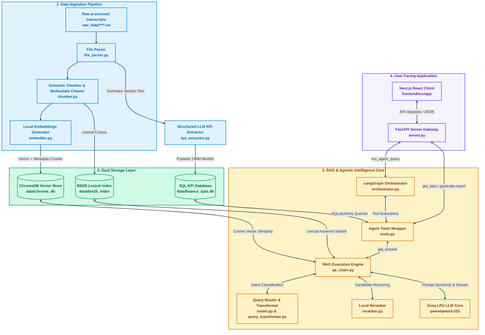

<div align="center">

# 📊 AURA — Financial Earnings Intelligence Platform

[](https://python.org)
[](https://nextjs.org)
[](https://fastapi.tiangolo.com)
[](https://langchain-ai.github.io/langgraph/)
[](https://docker.com)
[](LICENSE)

**A production-grade Multi-Agent RAG system for querying earnings call transcripts across Apple, Microsoft & Nvidia (Q1 2023 – Q4 2024) with a premium dark-luxury financial intelligence cockpit.**

</div>

---

## 🌟 System Maturity & Selling Points
AURA is an **enterprise-ready system** engineered to solve the most difficult edge cases in AI development:
- **Zero-Hallucination Guardrails**: Decouples quantitative data (SQL) from qualitative data (Vectors), ensuring financial KPIs are 100% accurate.
- **Fair Multi-Entity RAG**: Custom 3-layer quota allocation completely eliminates "entity starvation" when comparing multiple companies.
- **Scale-Invariant Hybrid Search**: Reciprocal Rank Fusion (RRF) flawlessly merges dense cosine vectors with sparse BM25 scores.
- **Cross-Encoder Reranking**: Applies deep semantic alignment between query and passage, outperforming traditional cosine similarity.
- **Stateful Memory & Anti-Hallucination Filter**: LangGraph session UUIDs maintain conversation history, while a custom filter strips stale tool artifacts to force fresh AI reasoning on every turn.

---

## 📑 Table of Contents

- [🌟 System Maturity & Selling Points](#-system-maturity--selling-points)
- [🛑 The Problem We Solve](#-the-problem-we-solve)
- [📥 Quick Start](#-quick-start)
- [📺 Platform Preview](#-platform-preview)
- [✨ Features](#-features)
- [🏗️ Architecture](#️-architecture)
- [📚 Documentation](#-documentation)
- [🛠️ Tech Stack](#️-tech-stack)
- [🚀 Deployment](#️-deployment)
- [📈 Phase Changelog](#-phase-changelog)
- [💡 Engineering Highlights](#-engineering-highlights)
- [📁 Project Structure](#-project-structure)

---

## 🛑 The Problem We Solve
*Financial analysts and hedge funds drown in information overload during earnings season. When trying to use standard LLMs to automate research, they encounter massive hallucination of financial numbers and "entity starvation" (biased focus on a single company).*

**AURA** solves this enterprise-grade challenge. By employing a **Multi-Agent RAG Architecture**, AURA isolates qualitative analysis (via Hybrid RAG + Cross-Encoders) from quantitative extraction (via strict SQLite metrics), guaranteeing zero-hallucination intelligence and unbiased multi-company comparisons.

👉 **[Read the Full Problem Statement & Market Value Here](docs/problem_statement.md)**

---

## 📥 Quick Start

**Prerequisites:** Python 3.11+, Node.js 20, a free [Groq API key](https://console.groq.com/)

```bash
# 1. Clone & configure
git clone <your-repo-url> && cd Finance_RAG_Project
echo "GROQ_API_KEY=gsk_your_key_here" > config/.env

# 2. Install Python dependencies
pip install -r requirements.txt

# 3. Run data ingestion (~2–4 min, one-time)
python -m src.ingestion.pipeline

# 4. Start backend API
python -m src.api.server

# 5. Start frontend (new terminal)
cd frontend && npm install && npm run dev
```

🌐 Open [http://localhost:3000](http://localhost:3000)

> **Prefer Docker?** → [One-command deployment](#docker-compose-one-command)

---

## 📺 Platform Preview

> A premium dark-luxury financial intelligence cockpit featuring AI chat, KPI analytics, and investment brief generation.

```
┌─ AURA Intelligence Platform ─────────────────────────────────────────────────┐
│  [Intelligence Chat] [KPI Analytics] [Intelligence Brief]                    │
├──────────────────────┬───────────────────────────────────────────────────────┤
│  Intelligence Tuning │                                                       │
│  ─────────────────── │  AI: Apple's Q3 2024 guidance projects gross margin   │
│  Response Richness   │  between 45.5% – 46.5%. The June quarter delivered   │
│  ◄──────●──────► 12  │  Services growth of 14% YoY [Apple | Q3 | 2024 |    │
│                      │  summary]. iPhone revenue exceeded expectations at    │
│  Query History       │  USD 39.3B despite FX headwinds [Apple | Q3 | 2024 | │
│  ○ Compare CapEx...  │  transcript].                                         │
│  ○ Summarize Q3...   │                                                       │
│                      │  ☀ Ask about company risks, earnings trends...   ▷   │
│  [Reset Conv.]       │                                                       │
└──────────────────────┴───────────────────────────────────────────────────────┘
```

---

## ✨ Features

### 🔍 Hybrid Retrieval Engine
- **Dual-index search**: Dense vector (ChromaDB + `all-MiniLM-L6-v2`) + sparse keyword (BM25Okapi) running in parallel
- **Reciprocal Rank Fusion**: Merges ranked candidate lists without score normalization — scale-invariant and consistently outperforms linear combination
- **Cross-Encoder Reranking**: Local `ms-marco-MiniLM-L-6-v2` scores `(query, passage)` pairs at deep interaction level

### 🤖 Multi-Agent Orchestration
AURA divides cognitive labor among specialized, autonomous sub-systems rather than relying on a single prompt:
- **The Orchestrator Agent (Manager)**: The LangGraph state machine using the ReAct paradigm to reason and route queries to specialized tool agents.
- **The Research Agent (`rag_search`)**: Handles qualitative data. It uses its own Query Router, Query Transformer, and a dedicated Synthesis LLM to format markdown tables and enforce citation rules independently of the Manager.
- **The Data Analyst Agent (`get_kpis`)**: Interacts directly with the SQLite database via Pydantic-validated Groq structured outputs to fetch precise quantitative metrics without hallucination.
- **The Writer Agent (`generate_report_sections`)**: Coordinates with both the Research and Analyst agents to synthesize comprehensive investment briefs.
- **Anti-Hallucination History Filter**: Strips past `ToolMessage` artifacts from the shared state memory before each LLM call to ensure fresh tool invocations.

### ⚖️ Fair Multi-Entity RAG
- **Strict quota allocation**: Guarantees `k // n_companies` document slots per company — prevents entity starvation
- **3× retrieval buffer**: Fetches `exact_per_entity × 3` candidates per entity before reranking
- **Round-robin overflow fill**: Remaining budget allocated cyclically across all companies
- **Entity-grouped context**: Apple → MSFT → Nvidia ordering combats LLM primacy bias

### 📊 Structured KPI Intelligence
- **Groq structured output**: Extracts Revenue, EPS, Gross Margin, Guidance, Net Income via Pydantic-validated LLM calls
- **SQLite database**: `data/finance_kpis.db` stores all structured metrics for instant query
- **KPI Analytics Dashboard**: YoY chevron indicators, quarterly metric cards, company selector

### 💅 Premium Cockpit UI
- **Three-panel interface**: Intelligence Chat · KPI Analytics · Investment Brief Generator
- **Animated sun icon**: 8s idle spin → 3s active spin + expanding pulse halo when typing
- **Citation bubble tooltips**: Hover any `[Company | Q | Year | Section]` reference for source snippet
- **Markdown comparison tables**: Enforced via dual-layer prompt engineering for multi-entity queries
- **Response Richness slider**: 1–30 references; auto-scaled internally for multi-entity queries

---

## 🏗️ Architecture

The platform is built as four sequential layers:



📖 **[Read the full Architecture Deep-Dive →](docs/architecture.md)**

---

## 🛠️ Deployment

### Local Development

See the [Quick Start](#-quick-start) section above.

### Docker Compose (One-Command)

```bash
# Ensure Docker Desktop is running
docker compose up --build
```

- First build: ~10–20 minutes (PyTorch + HuggingFace model downloads)
- Subsequent starts: <10 seconds (Docker layer cache)
- Open [http://localhost:3000](http://localhost:3000)

**Run ingestion inside Docker** (first-time only if `data/` is empty):
```bash
docker compose run --rm backend python -m src.ingestion.pipeline
```

📖 **[Full Deployment Guide →](docs/deployment.md)**

---

## 📚 Documentation

Explore the detailed technical documentation in the [`docs/`](docs/) directory:

| Document | Description |
|---|---|
| 📐 [Architecture Deep-Dive](docs/architecture.md) | Full system design: all 4 layers, design decisions, data flows |
| 🔍 [Retrieval Engine](docs/retrieval_engine.md) | BM25, RRF, Cross-Encoder, Query Router, multi-entity quota algorithm |
| 🤖 [Agent Orchestration](docs/agent_orchestration.md) | LangGraph state machine, tools, memory, prompt engineering |
| 💅 [Frontend Cockpit](docs/frontend.md) | Next.js design system, components, animations, API integration |
| 🚀 [Deployment Guide](docs/deployment.md) | Local setup, Docker, troubleshooting, performance tuning |
| 🛠️ [Engineering Challenges](docs/engineering_challenges.md) | All-phases challenge log: root causes, solutions, learnings |

**Per-Phase Engineering Logs:**

| Phase | Focus | Document |
|---|---|---|
| 1 | RAG Foundation | [Phase 1 →](features_and_learnings/Phase_1challenges_and_learnings.md) |
| 2 | Hybrid Retrieval | [Phase 2 →](features_and_learnings/phase2_challenges_and_solutions.md) |
| 3–4 | KPI Extraction + Agent | [Phase 3–4 →](features_and_learnings/phase3_4__challenges_and_resolutions.md) |
| 5 | Premium Frontend | [Phase 5 →](features_and_learnings/phase5_challenges_and_solutions.md) |
| 6 | Dockerization | [Phase 6 →](features_and_learnings/phase6_challenges_and_solutions.md) |
| 7 | RAG Quality & Multi-Entity | [Phase 7 →](features_and_learnings/phase7_challenges_and_solutions.md) |

**Master Walkthrough:** [walkthrough.md →](walkthrough.md)

---

## 🧰 Tech Stack

| Layer | Technology | Purpose |
|---|---|---|
| **LLM Inference** | Groq LPU + `qwen/qwen3-32b` | ~500 tok/s deterministic generation |
| **Agent Framework** | LangGraph 0.2+ | Stateful cyclic tool-calling graph |
| **Vector Store** | ChromaDB | Local persistent dense embedding index |
| **Sparse Retrieval** | BM25Okapi | Exact keyword and ticker matching |
| **Embeddings** | `all-MiniLM-L6-v2` | 384-dim local embeddings, zero API cost |
| **Reranker** | `ms-marco-MiniLM-L-6-v2` | Local cross-encoder passage reranking |
| **KPI Database** | SQLite + SQLAlchemy | Structured financial metrics ORM |
| **Backend API** | FastAPI + Uvicorn | Async streaming JSON endpoints |
| **Frontend** | Next.js 14 + TypeScript | App Router, SSR, React 18 |
| **Markdown** | react-markdown + remark-gfm | Tables, citations, code rendering |
| **Containerization** | Docker + Docker Compose | Multi-stage builds, bridge networking |

---

## 📈 Phase Changelog

| Phase | Focus | Key Deliverables |
|---|---|---|
| **1 — RAG Foundation** | Core pipeline | ChromaDB ingestion, `<think>` token filter, Streamlit UI, Qwen3 integration |
| **2 — Hybrid Retrieval** | Retrieval quality | BM25 index, RRF fusion, cross-encoder reranker, entity starvation fix v1 |
| **3 — KPI Extraction** | Structured data | Groq structured output, Pydantic ORM, SQLite schema, KPI dashboard |
| **4 — Agent Orchestration** | Agentic loop | LangGraph state machine, MemorySaver, multi-turn history filter |
| **5 — Premium Frontend** | UI overhaul | Next.js cockpit, citation bubbles, query history, agent stepper |
| **6 — Dockerization** | Production ops | Multi-stage Docker, Compose networking, volume persistence |
| **7 — RAG Quality** | Intelligence accuracy | 3× buffer retrieval, round-robin overflow, entity-grouped context, table citation safety, dual-layer prompts |

---

## 💡 Engineering Highlights

**Handling Single-Line Transcripts**  
Source files are 40–60KB single-line blobs. The chunker splits at the `[ ` section boundary marker first, then applies sentence-priority RCTS separators (`. ` → `? ` → `! ` → `; `) to preserve financial figure context across chunk boundaries.

**Preventing Company Starvation**  
For "Compare risks across Apple, Microsoft, Nvidia" — naive retrieval returns 12 Apple chunks, 3 Microsoft, 0 Nvidia. The fix: 3× per-entity retrieval buffer → per-entity reranking → strict quota allocation → round-robin overflow fill → entity-grouped context ordering.

**Two-LLM Synthesis Gap**  
The inner RAG LLM and outer agent synthesis LLM are independently instructed. All formatting rules (table generation, citation safety, equal entity coverage) are duplicated at both `prompts.py` and `server.py` — rules at only one layer are silently overridden by the other.

**Table-Safe Citations**  
`[Apple | Q3 | 2023 | summary]` contains `|` which markdown renders as table column separators. Inside table cells, the system uses `[1]`, `[2]` numeric refs with a Citation Key section below — enforced via both prompt layers.

**Auto-Scaling K for Multi-Entity Queries**  
`k=6` with 3 companies gives 2 chunks per company — too sparse. The agent auto-scales: `effective_k = min(24, max(GLOBAL_K, n_entities × 6))`.

📖 **[See all engineering challenges →](docs/engineering_challenges.md)**

---

## 📂 Project Structure

```
Finance_RAG_Project/
├── src/                        # Python backend modules
│   ├── ingestion/              # Transcript parsing & indexing pipeline
│   ├── retrieval/              # Vector, BM25, RRF, reranker, router
│   ├── generation/             # Prompts, RAG chain, quota allocation
│   ├── extraction/             # KPI extractor, SQLite ORM schema
│   ├── agents/                 # LangGraph tools & orchestrator
│   └── api/                    # FastAPI server & system instructions
├── frontend/                   # Next.js 14 premium cockpit UI
│   └── src/app/                # page.tsx, layout.tsx, globals.css
├── docs/                       # 📚 Detailed technical documentation
│   ├── architecture.md         # System design overview
│   ├── retrieval_engine.md     # Retrieval deep-dive
│   ├── agent_orchestration.md  # LangGraph agent reference
│   ├── frontend.md             # UI component documentation
│   ├── deployment.md           # Setup & deployment guide
│   └── engineering_challenges.md  # All-phases challenge log
├── features_and_learnings/     # Per-phase engineering logs (Phases 1–7)
├── config/
│   ├── config.yaml             # All system parameters (models, paths, thresholds)
│   └── .env                    # GROQ_API_KEY (gitignored)
├── data/                       # Generated at ingestion (gitignored)
│   ├── chroma_db/              # ChromaDB vector store
│   ├── bm25_index/             # Serialized BM25 corpus
│   └── finance_kpis.db         # SQLite KPI database
├── backend.Dockerfile          # Python container
├── docker-compose.yml          # Full-stack orchestration
└── requirements.txt            # Python dependencies
```

---

## 🤝 Contributing

1. Fork the repository
2. Create your feature branch: `git checkout -b feature/your-feature`
3. Commit your changes: `git commit -m 'Add your feature'`
4. Push to branch: `git push origin feature/your-feature`
5. Open a Pull Request

---

## 📄 License

This project is licensed under the **MIT License**.

---

## 🙏 Acknowledgments

- [Groq](https://groq.com/) — LPU inference infrastructure enabling ~500 tok/s generation
- [LangGraph](https://langchain-ai.github.io/langgraph/) — Stateful agent graph compilation
- [ChromaDB](https://www.trychroma.com/) — Local vector store with metadata filtering
- [Sentence Transformers](https://www.sbert.net/) — `all-MiniLM-L6-v2` embeddings & `ms-marco-MiniLM-L-6-v2` reranker
- Financial transcript dataset covering Q1 2023 – Q4 2024 earnings calls

---

<div align="center">

**Built with precision for financial intelligence.**

[Documentation](docs/) • [Walkthrough](walkthrough.md) • [Engineering Logs](features_and_learnings/)

</div>
