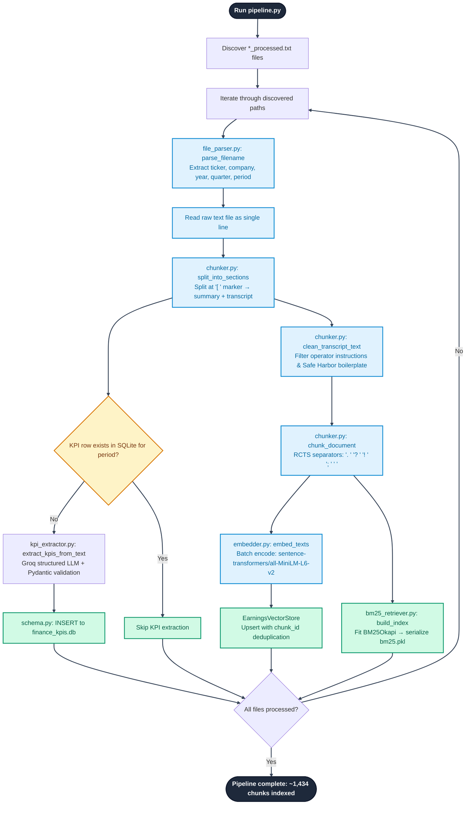

# Architecture Deep-Dive

> **[← Back to README](../README.md)** | [Data Ingestion →](./data_ingestion.md) | [Retrieval Engine →](./retrieval_engine.md) | [Agent Orchestration →](./agent_orchestration.md) | [Frontend →](./frontend.md)

---

## Overview

AURA is a **production-grade Multi-Agent Retrieval-Augmented Generation (RAG) system** purpose-built for financial transcript intelligence. The architecture is composed of four distinct layers that work sequentially to transform raw unstructured text into verified, cited financial intelligence.

```
Raw Transcripts (TXT)
        ↓
[ 1. Data Ingestion Layer ]  →  ChromaDB + BM25 + SQLite
        ↓
[ 2. Hybrid Retrieval Engine ]  →  RRF Fusion + Cross-Encoder Reranker
        ↓
[ 3. LangGraph Agent Orchestrator ]  →  Tool-Calling State Machine
        ↓
[ 4. FastAPI + Next.js Frontend ]  →  Premium Chat Cockpit
```

---

## Layer 1 — Data Ingestion Pipeline

The ingestion layer converts raw, single-line earnings call transcript `.txt` files into three indexed storage systems.



### Key Components

| Module | File | Responsibility |
|---|---|---|
| File Parser | `src/ingestion/file_parser.py` | Extracts company, ticker, year, quarter from filename via regex |
| Chunker | `src/ingestion/chunker.py` | 2-step RCTS chunker: splits at section marker `[ ` then applies sentence-boundary separators |
| Embedder | `src/ingestion/embedder.py` | Singleton wrapper for `all-MiniLM-L6-v2` (384-dim, fully local, zero API cost) |
| Pipeline | `src/ingestion/pipeline.py` | Orchestrates discovery → parse → embed → index loop across all 23 transcripts |
| KPI Extractor | `src/extraction/kpi_extractor.py` | Structured LLM call with Pydantic validation to extract quantitative metrics |
| Schema | `src/extraction/schema.py` | SQLAlchemy ORM models for the `finance_kpis.db` SQLite database |

### Chunking Strategy

The transcripts are stored as a **single long line per file** (~40–60 KB with no newlines). Standard splitters fail on this format. The pipeline uses a 2-phase approach:

```
Raw file (single line)
    ↓ split at "[ " marker
[summary section] + [transcript section]
    ↓ apply RCTS with sentence-priority separators
    ". " → "? " → "! " → "; " → " " → ""
    ↓ target chunk_size=1000 chars, overlap=200 chars
Individual semantic chunks with metadata attached
```

Each chunk carries metadata: `{company, ticker, year, quarter, section, chunk_id}`.

### Storage Outputs

| Storage | Path | Contents |
|---|---|---|
| ChromaDB Vector Store | `data/chroma_db/` | ~1,434 dense embedding vectors (384-dim cosine space) |
| BM25 Lexical Index | `data/bm25_index/bm25.pkl` | Serialized `BM25Okapi` corpus for sparse keyword retrieval |
| SQLite KPI Database | `data/finance_kpis.db` | Structured financial metrics: Revenue, EPS, Gross Margin, Guidance, Net Income |

---

## Layer 2 — Hybrid Retrieval Engine

The retrieval engine fuses two complementary retrieval paradigms and applies deep semantic reranking.

### Pipeline Flow

```
User Query
    ↓
[ Query Router ]  →  classifies strategy (9 possible routes)
    ↓
[ Query Transformer ]  →  rewrites pronouns & temporal context from chat history
    ↓
[ Parallel Retrieval ]
    ├── ChromaDB Vector Search (cosine similarity, top-20 candidates)
    └── BM25 Lexical Search (Okapi BM25, top-20 candidates)
        ↓
[ Reciprocal Rank Fusion ]  →  score = Σ 1/(60 + rank_i) per candidate
        ↓
[ Cross-Encoder Reranker ]  →  ms-marco-MiniLM-L-6-v2 scores each (query, chunk) pair
        ↓
[ Strict Quota Allocation ]  →  k // n_entities slots reserved per company (multi-entity)
        ↓
[ Context Assembly ]  →  sorted by entity group, formatted with citation headers
        ↓
[ LLM Generation ]  →  qwen/qwen3-32b, temperature=0.0
```

### Query Router — 9 Strategies

| Strategy | Trigger | Mode |
|---|---|---|
| `multi_entity_risk_analysis` | risk terms + multi-company | `rerank` |
| `multi_entity_retrieval` | comparison/all-company phrase | `rerank` |
| `single_entity_risk_analysis` | risk terms, one company | `rerank` |
| `single_entity_financial_summary` | summarize + financial terms | `rerank` |
| `single_entity_financial_metric` | specific KPI, one company | `rerank` |
| `comparison_query` | compare/vs/trend terms | `sql` |
| `exact_fact_query` | product names, executive names | `rerank` |
| `summary_section` | "summarize this call" | `vector` |
| `vector_only` | broad qualitative questions | `rerank` |

The router uses a two-tier approach: **LLM classification** when a Groq model is available, with **rule-based keyword fallback** always available offline.

### Multi-Entity Retrieval — Quota Allocation

For queries spanning multiple companies (e.g., "Compare risks across all companies"), naive retrieval causes **entity starvation** — one dominant company (highest semantic similarity) crowds out others. The solution is a 3-layer fix:

1. **3× Retrieval Buffer**: Fetch `k_per_entity × 3` candidates per company before reranking
2. **Per-Company Reranking**: Each company's pool is scored independently
3. **Round-Robin Overflow Fill**: Remaining budget slots are filled in a round-robin cycle across all entities

---

## Layer 3 — LangGraph Agent Orchestrator

The agent is a **stateful cyclic graph** compiled with LangGraph. It operates as a ReAct-style agent with persistent session memory.

### Graph Topology

```
START
  ↓
[chatbot_node]  →  Qwen3-32b evaluates intent
  ↓ (has tool_calls?)
  ├── YES → [tools_node]  →  executes tool
  │             ├── rag_search    →  triggers hybrid RAG
  │             ├── get_kpis      →  queries SQLite
  │             └── generate_report_sections  →  aggregates both
  │         ↓ (appends ToolMessage to state)
  │         → [chatbot_node]  (loop back)
  └── NO → END  (returns final AIMessage)
```

### Memory & Session Management

- **Checkpointer**: `MemorySaver` from LangGraph — persists full message thread per `thread_id`
- **Thread Isolation**: Each browser session generates a unique UUID `thread_id`. Different users never share state.
- **History Filtering**: `filter_messages_for_llm()` strips historical `ToolMessage` objects from past turns to prevent context recycling hallucinations, while preserving clean human/assistant conversation history.

### Agent System Instruction (server.py)

The agent's final synthesis pass is governed by a comprehensive system instruction injected into every query covering:
- Response length scaling proportional to context size
- Citation preservation rules
- Multi-entity equal coverage mandate
- Comparison table generation requirement
- Table-safe citation format (numeric refs inside cells)

---

## Layer 4 — Application Layer

### Backend: FastAPI (`src/api/server.py`)

| Endpoint | Method | Purpose |
|---|---|---|
| `/` | GET | Health check |
| `/api/chat` | POST | Primary chat endpoint — runs agent, returns message + source snippets |
| `/api/kpis` | GET | Direct SQLite KPI query for dashboard |
| `/api/generate-report` | POST | Triggers full investment brief generation via agent |

### Frontend: Next.js 14 (`frontend/src/app/`)

Three main panels available via tab navigation:
- **Intelligence Chat** — Multi-turn RAG chat with citation cards and source panel
- **KPI Analytics** — Structured financial metrics dashboard with YoY trend indicators
- **Intelligence Brief** — Automated investment research report generator

---

## Key Design Decisions

| Decision | Rationale |
|---|---|
| Local embeddings (`all-MiniLM-L6-v2`) | Zero API cost, no rate limits, reproducible embeddings |
| `temperature=0.0` | Financial facts require deterministic, non-creative responses |
| Cross-encoder reranker (local) | No API calls needed; `ms-marco-MiniLM-L-6-v2` runs on CPU in <1s |
| Groq LPU for generation | ~500 tokens/second inference — essential for responsive chat |
| BM25 + Vector fusion | BM25 excels at exact ticker/metric recall; vector excels at semantic intent matching |
| LangGraph state machine | Supports multi-turn memory, tool routing, and graceful error recovery natively |
| Strict quota allocation | Prevents entity starvation in multi-company comparative analyses |
