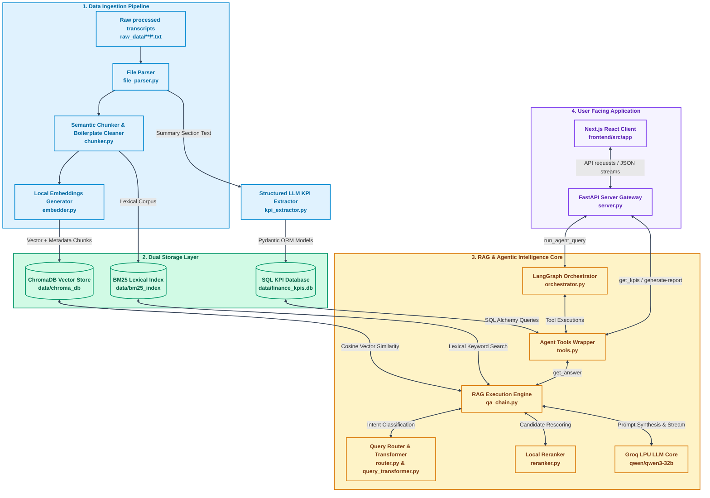

# Detailed RAG Architecture Mindmap

> **[← Back to Architecture Overview](./architecture.md)**

This document provides a holistic blueprint of the AURA Financial Intelligence Platform, tracking the data flow from raw unstructured transcripts through the storage, retrieval, orchestration, and presentation layers.

---

## The System Ecosystem Flowchart

The following mindmap illustrates the 4 core subsystems of AURA and how they interconnect to provide zero-hallucination, multi-agent financial intelligence.

---

## Architectural Layer Breakdown

### 1. Data Ingestion Pipeline (Blue)
The ingestion layer is responsible for converting unstructured walls of text into structured, searchable data.
- **File Parser (`file_parser.py`)**: Identifies the ticker, company, year, and quarter from filenames.
- **Chunker (`chunker.py`)**: Slices the massive transcripts using RCTS (Recursive Character Text Splitting) prioritized for sentence terminators (`.`, `?`, `!`) to avoid splitting mid-sentence and ruining financial context. It actively scrubs forward-looking "Safe Harbor" boilerplate language to clean the dataset.
- **Extractor (`kpi_extractor.py`)**: Uses a separate LLM call mapped strictly to a Pydantic schema to extract the hard numeric KPIs from the "Summary" section of the earnings call, ensuring numbers are completely isolated from text context.

### 2. Dual Storage Layer (Green)
AURA deliberately does NOT put all data in one place. It routes data to where it performs best:
- **ChromaDB**: Holds the `all-MiniLM-L6-v2` dense vectors. Excellent for conceptual questions like *"What is their AI strategy?"*
- **BM25 Lexical Index**: Holds the sparse lexical index. Excellent for exact-match questions like *"How much Azure revenue did Satya Nadella mention?"*
- **SQL Database**: Holds the rigid numbers extracted during ingestion. Completely sidesteps LLM hallucination for questions like *"What was Microsoft's EPS in Q2 2024?"*

### 3. RAG & Agentic Intelligence Core (Yellow)
This is the "Brain" of the platform, built using LangGraph.
- **LangGraph Orchestrator (`orchestrator.py`)**: Maintains conversational memory using a `MemorySaver` checkpointer. Critically, it scrubs old context out to prevent multi-turn hallucination.
- **Query Router (`router.py`)**: Dynamically decides which retrieval strategy to use (e.g., should I run an SQL comparison, or should I do a hybrid search?).
- **RAG Execution Engine (`qa_chain.py`)**: Uses a **3-Layer Quota Allocator** for multi-entity queries. It pulls from both Chroma and BM25, merges the lists using Reciprocal Rank Fusion, and then aggressively reranks them using `ms-marco-MiniLM-L-6-v2` before giving them to the `qwen/qwen3-32b` generation model.

### 4. User-Facing Application (Purple)
The client delivery mechanism that ties the AI architecture to the human user.
- **FastAPI Gateway (`server.py`)**: Translates HTTP REST endpoints into internal LangGraph graph executions and streams the JSON chunks back to the client. It also acts as the secondary prompt enforcer for the `TABLE CITATION SAFETY` rule.
- **Next.js React Client**: A premium dark-luxury frontend that renders the markdown streams (including complex tables), manages the query history via `localStorage`, and displays real-time agent progression steppers.
