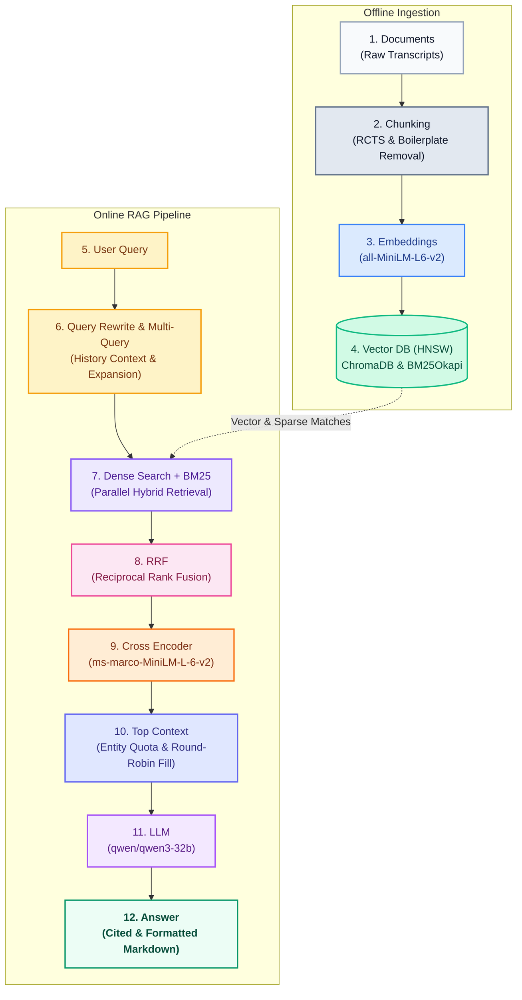

# Detailed RAG Architecture Mindmap

> **[← Back to Architecture Overview](./architecture.md)**

This document provides a deep-dive blueprint of the complete, end-to-end Retrieval-Augmented Generation (RAG) lifecycle implemented within AURA. 

It maps out the precise flow of data from offline ingestion to the final LLM response, encompassing hybrid search, reciprocal rank fusion, and multi-query expansion.

---

## The Complete RAG Flowchart

---

## Detailed Step-by-Step Explanation

### 1. Documents
The pipeline begins with raw, unstructured earnings call transcripts (Apple, Microsoft, Nvidia from Q1 2023 to Q4 2024). These are ingested as massive single-line text blobs.

### 2. Chunking
Handled by `chunker.py`. Due to the nature of financial transcripts, standard text splitting destroys numeric context. AURA uses **Recursive Character Text Splitting (RCTS)** prioritized on sentence boundaries (`. `, `? `, `! `) and aggressively filters out forward-looking "Safe Harbor" boilerplate language to increase signal-to-noise ratio.

### 3. Embeddings
Chunks are passed through the local `sentence-transformers/all-MiniLM-L6-v2` embedding model to generate dense semantic vector representations.

### 4. Vector DB (HNSW) & Sparse Index
Data is simultaneously loaded into two systems:
- **ChromaDB**: Stores the 384-dimensional dense vectors using HNSW indexing for rapid semantic similarity search.
- **BM25 Index**: Stores a sparse lexical corpus (`bm25.pkl`) for exact keyword, ticker, and specific numeric value matching.

### 5. User Query
The user enters a natural language query via the Next.js React frontend.

### 6. Query Rewrite / Multi-Query
Before hitting the databases, the query goes through `query_transformer.py`:
- **Query Rewrite**: If conversational history exists, pronouns and temporal contexts are resolved.
- **Multi-Query Expansion**: For complex comparison trends, the system breaks the query down into sub-queries to retrieve a broader spectrum of context.

### 7. Dense Search + BM25
The transformed queries run in parallel against both indexes. ChromaDB performs nearest-neighbour search (Dense) while BM25 handles exact keyword intersections (Sparse).

### 8. RRF (Reciprocal Rank Fusion)
Handled by `hybrid_retriever.py`. Because Vector scores (cosine distance) and BM25 scores (IDF weights) are on entirely different scales, RRF is used to merge the candidate lists based purely on their rank positions, making the retrieval scale-invariant and highly accurate.

### 9. Cross Encoder
The top 30-40 candidates from the RRF output are passed to a local `cross-encoder/ms-marco-MiniLM-L-6-v2` model in `reranker.py`. Instead of fast vector similarity, this model computes a deep, pairwise semantic interaction between the Query and the Document Chunk, vastly outperforming standard cosine similarity.

### 10. Top Context
Once reranked, the chunks pass through AURA's custom **3-Layer Quota Allocator**. If the user is asking to compare Apple and Microsoft, the system ensures that the final contextual window is populated with an exact 50/50 split of Apple and Microsoft chunks using a Round-Robin overflow fill, completely eliminating "Entity Starvation".

### 11. LLM
The finely-tuned, entity-balanced context is injected into a heavily engineered system prompt. The Groq LPU API calls `qwen/qwen3-32b` with strict instructions governing markdown tables, citation safety (preventing `|` characters in citations), and hallucination guardrails.

### 12. Answer
The LLM generates the final cited markdown response, which is streamed via FastAPI server-sent events back to the Next.js UI, where it renders beautifully alongside real-time citation tooltip bubbles.
