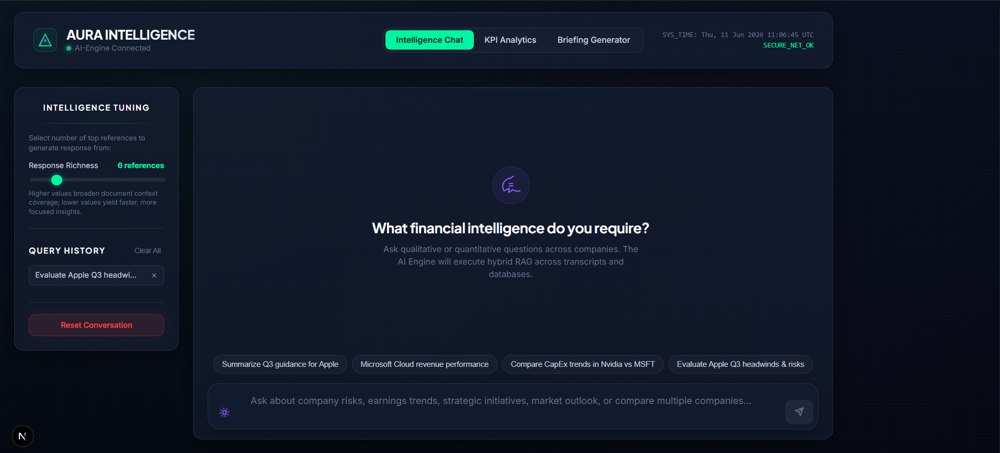

# Frontend — Premium Cockpit UI

> **[← Architecture](./architecture.md)** | **[← README](../README.md)**

---

## Overview

The AURA frontend is a **premium dark-luxury financial intelligence cockpit** built with Next.js 14 and vanilla CSS. It features three interactive panels: an AI chat interface, a KPI analytics dashboard, and an investment brief generator.

---

## Tech Stack

| Technology | Version | Purpose |
|---|---|---|
| Next.js | 14 | React framework with App Router |
| React | 18 | UI component model |
| TypeScript | 5 | Type-safe component props |
| `react-markdown` | latest | Markdown rendering for AI responses |
| `remark-gfm` | latest | GitHub-Flavoured Markdown (tables, strikethrough) |
| Vanilla CSS | — | Design system via CSS custom properties |
| Google Fonts | Inter + Plus Jakarta Sans | Premium typography |

---

## Design System (`globals.css`)

### Color Palette

```css
:root {
  /* Base */
  --bg-base:              #0A0F1E;  /* Deep navy — primary background */
  --bg-surface-secondary: #111827;  /* Slightly lighter surface */
  --bg-card:              #151F34;  /* Card background */
  --bg-glass:     rgba(21, 31, 52, 0.65);  /* Glassmorphism base */

  /* Accents */
  --primary-accent:   #00F5A0;  /* Vibrant emerald mint — primary brand colour */
  --secondary-accent: #10B981;  /* Success green — secondary brand */
  --ai-accent:        #8B5CF6;  /* Purple — AI indicator colour */

  /* Status */
  --success: #10B981;
  --warning: #F59E0B;
  --danger:  #EF4444;

  /* Typography */
  --text-primary:   #F8FAFC;
  --text-secondary: #CBD5E1;
  --text-muted:     #64748B;

  /* Spacing tokens */
  --radius-lg: 16px;
  --radius-md: 12px;
  --radius-sm: 8px;
}
```

### Layered Background System

Three stacked CSS layers create the atmospheric depth:

```
Layer -2 (body::before): Navy gradient + ambient radial glows
Layer -1 (body::after):  50×50px grid pattern at 1.5% opacity
Layer 0:                 Page content
```

### Glassmorphism Cards

```css
.glass {
  background: var(--bg-glass);          /* Semi-transparent dark navy */
  backdrop-filter: blur(20px);          /* Frosted glass blur */
  border: 1px solid rgba(255,255,255,0.08);
  box-shadow: 0 8px 32px rgba(0,0,0,0.35);
  border-radius: var(--radius-lg);
}
.glass-card:hover {
  transform: translateY(-2px);
  box-shadow: 0 12px 40px rgba(0,0,0,0.45), 0 0 25px rgba(0,245,160,0.12);
  border-color: rgba(0,245,160,0.25);   /* Mint glow on hover */
}
```

---

## Application Layout

```
┌─ Header (AURA logo + tab navigation + system time) ─────────────────────┐
│                                                                          │
│  [Intelligence Chat Tab]                                                 │
│  ┌──────────────────┬─────────────────────────────────────────────────┐ │
│  │  Intelligence    │                                                  │ │
│  │  Tuning Sidebar  │         Chat Message Feed                       │ │
│  │                  │                                                  │ │
│  │  ─ Slider ─      │  [AI] Response with markdown, citations, tables  │ │
│  │  ─ History ─     │  [U]  User query bubble                          │ │
│  │  ─ Reset ─       │                                                  │ │
│  └──────────────────┴──────────── Query Input Box ──────────────────── ┘ │
│                                                                          │
│  [KPI Analytics Tab]                                                     │
│  ┌──────────────────────────────────────────────────────────────────────┐│
│  │  Company Selector + Reload Button                                    ││
│  │  Grid of KPI Cards (Revenue, EPS, Gross Margin, Net Income, Guidance)││
│  └──────────────────────────────────────────────────────────────────────┘│
│                                                                          │
│  [Intelligence Brief Tab]                                                │
│  ┌──────────────────┬─────────────────────────────────────────────────┐ │
│  │  Brief Params    │                                                  │ │
│  │  (Company,Year,  │         Report Markdown Viewport                 │ │
│  │  Quarter)        │                                                  │ │
│  │  [Generate Btn]  │                                                  │ │
│  └──────────────────┴─────────────────────────────────────────────────┘ │
└──────────────────────────────────────────────────────────────────────────┘
```



---

## Components & Features

### 1. Intelligence Chat (`ChatInterface` function)

**Animated Sun Icon**

The sun SVG icon left of the query textarea is animated:
- **Idle state**: slow 360° spin every 8 seconds (`spin-sun 8s linear infinite`)
- **Active state** (user typing): fast 3-second spin + bright purple glow + expanding `ping-ring` pulse halo

```css
@keyframes spin-sun  { from { transform: rotate(0deg); } to { transform: rotate(360deg); } }
@keyframes ping-ring { 0% { transform: scale(0.8); opacity: 0.7; } 100% { transform: scale(1.8); opacity: 0; } }
```

**Suggestion Chips**

Four pre-configured query chips display on the empty chat state:
- *"Summarize Q3 guidance for Apple"*
- *"Microsoft Cloud revenue performance"*
- *"Compare CapEx trends in Nvidia vs MSFT"*
- *"Evaluate Apple Q3 headwinds & risks"*

**Citation Cards**

AI responses are parsed for `[Company | Quarter | Year | Section]` citation patterns. Each citation renders as an interactive `CitationBubble` component with a hover tooltip showing the source snippet text.

**Response Richness Slider**

A custom-styled `<input type="range">` (1–30) maps directly to the backend `top-k` parameter. Controls how many source chunks the RAG engine retrieves and considers.

**Query History**

Persisted to `localStorage` as `aura_query_history`. Renders clickable chips in the sidebar. Supports individual deletion (×) and full "Clear All" wipe.

**Agent Pipeline Stepper** *(during response generation)*

A live log panel intercepts streaming status tokens and updates a visual progress stepper:
1. 🔍 Routing query...
2. 🧠 Calling `rag_search` tool...
3. 📊 Reranking candidates...
4. ✍️ Synthesising final response...

---

### 2. KPI Analytics Dashboard (`KpiDashboard` function)

Fetches structured KPI data from `/api/kpis` and renders each quarter's metrics in a card grid:

| Metric | Display |
|---|---|
| Revenue | USD value in billions |
| Diluted EPS | USD per share |
| Gross Margin | % with colour-coded progress bar |
| Net Income | USD value in billions |
| YoY Revenue Growth | % with chevron arrow (↑ green / ↓ red) |
| Guidance Range | Low–High USD range |

---

### 3. Intelligence Brief Generator (`ReportPanel` function)

- **Company/Year/Quarter selectors**: Dropdown controls bound to state
- **Generate button**: Posts to `/api/generate-report` which runs the full `generate_report_sections` agent tool pipeline
- **Synthesis Pipeline Stepper**: Animated 4-step log displayed while the backend agent compiles the brief
- **Report viewport**: Renders the full markdown investment research brief via `react-markdown` + `remark-gfm`

---

### 4. Live Agent Workflow Monitor (`/monitor`)

A dedicated observability page built with `@xyflow/react` (React Flow) that visualizes the backend LangGraph agent execution in real-time.

- **Dynamic Graph Rendering**: Displays the complete agent topology (`START`, `Chatbot`, `Tool Router`, and all tools).
- **Server-Sent Events (SSE)**: Subscribes to `/api/workflow-stream` to receive state updates from the backend event bus.
- **Visual Polish**: Active nodes display a pulsating golden border (`#ECC94B`) while executing. Edges animate to trace the active path.
- **Side Panel Logs**: Shows the current query, active tool name, live tool arguments, output previews, and a timestamped event log.

---

## Markdown Rendering

AI responses render via `react-markdown` with `remarkGfm` plugin, supporting:
- **Tables**: GitHub-Flavoured Markdown tables (critical for comparison query output)
- **Code blocks**: Syntax-highlighted via CSS
- **Bold/italic**: Standard markdown emphasis
- **Citations**: Custom `a` element renderer that intercepts `citation:` href scheme to render `CitationBubble` components

```tsx
<ReactMarkdown
  remarkPlugins={[remarkGfm]}
  components={{
    a: ({ href, children }) => {
      if (href?.startsWith('citation:')) {
        return <CitationBubble citation={citationKey} snippet={source?.snippet} />;
      }
      return <a href={href} target="_blank">{children}</a>;
    }
  }}
>
  {message.content}
</ReactMarkdown>
```

---

## Hydration & SSR Considerations

Two client-only operations required `useEffect` wrapping to prevent Next.js SSR hydration mismatches:

1. **Thread ID generation** (`crypto.randomUUID()`) — runs only on client mount
2. **localStorage access** (`aura_query_history`) — only available in browser

```tsx
useEffect(() => {
  setMounted(true);
  setThreadId(crypto.randomUUID().slice(0, 10));
  const saved = localStorage.getItem('aura_query_history');
  if (saved) setHistory(JSON.parse(saved));
}, []);

if (!mounted) return <LoadingScreen />;
```

`suppressHydrationWarning` is set on the `<body>` tag in `layout.tsx` to prevent browser extension interference.

---

## API Communication

All API calls go to `http://localhost:8000` (development) / `http://backend:8000` (Docker):

```typescript
// Chat endpoint
const res = await fetch('http://localhost:8000/api/chat', {
  method: 'POST',
  headers: { 'Content-Type': 'application/json' },
  body: JSON.stringify({ query, k: kValue, thread_id: threadId })
});
const { message, sources } = await res.json();
// message: AI response text
// sources: [{citation, snippet}] for the citation panel
```

---

## Docker Configuration

The frontend runs as a multi-stage Docker build:

**Stage 1 (builder):** `node:20-alpine` — installs all `node_modules`, runs `npm run build`, generates the optimized `.next/` output.

**Stage 2 (runner):** `node:20-alpine` — copies only `.next/`, `public/`, and production `node_modules`. Strips 400MB+ of dev dependencies from the final image.

**Network:** In `docker-compose.yml`, the frontend service uses `NEXT_PUBLIC_API_URL=http://backend:8000` to route API calls to the backend service via Docker's internal DNS.

---

## ⚠️ Disclaimer

> *This document is part of an educational and research project. All outputs generated by AURA — including financial summaries, KPI analyses, and investment research briefs — are for informational purposes only and do not constitute financial advice, investment recommendations, or solicitations to buy or sell any securities. Always consult a qualified financial professional before making investment decisions.*

