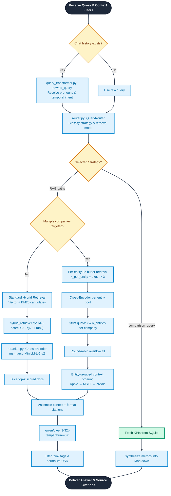

# Retrieval Engine — Technical Reference

> **[← Architecture](./architecture.md)** | **[← README](../README.md)**

---

## Overview

The retrieval engine is the intelligence core of AURA. It fuses three complementary retrieval paradigms — **dense semantic vector search**, **sparse keyword (BM25) search**, and **cross-encoder reranking** — to deliver the most relevant financial context passages for each user query.



---

## Module Map

```
src/retrieval/
├── vector_store.py       — ChromaDB interface (dense cosine similarity)
├── bm25_retriever.py     — Sparse BM25Okapi index (exact keyword matching)
├── hybrid_retriever.py   — Reciprocal Rank Fusion (merges dense + sparse)
├── reranker.py           — Cross-Encoder passage reranker
├── router.py             — Query intent classifier + strategy dispatcher
└── query_transformer.py  — Query rewriter for multi-turn context resolution
```

---

## 1. Vector Store (`vector_store.py`)

**Engine:** ChromaDB with local SQLite persistence  
**Embedding Model:** `sentence-transformers/all-MiniLM-L6-v2` (384 dimensions)  
**Distance Metric:** Cosine similarity

### Key Operations

```python
class EarningsVectorStore:
    def add_documents(docs, embeddings, metadatas)  # Batch upsert with chunk_id deduplication
    def query(query_text, k, filters)               # Semantic nearest-neighbour search
    def count()                                      # Collection size check
```

**Metadata Filters**: ChromaDB `where` clauses enable pre-filtering by `company`, `year`, `quarter`, `section` before distance computation — critical for focused single-entity queries.

---

## 2. BM25 Retriever (`bm25_retriever.py`)

**Algorithm:** BM25Okapi (Robertson & Walker, 1994)  
**Corpus:** All chunk texts tokenized and fitted at ingestion time  
**Persistence:** Serialized as `data/bm25_index/bm25.pkl` via Python `pickle`

BM25 is particularly effective for:
- Exact ticker symbols: `AAPL`, `NVDA`, `MSFT`
- Precise financial metric names: `"gross margin"`, `"diluted EPS"`, `"Azure revenue"`
- Numeric values: `"3.56"`, `"69.7 billion"`
- Executive names: `"Jensen Huang"`, `"Tim Cook"`, `"Satya Nadella"`

---

## 3. Reciprocal Rank Fusion (`hybrid_retriever.py`)

RRF merges ranked candidate lists from the vector and BM25 retrievers into a unified score without requiring score normalization.

**Formula:**
```
RRF_score(d) = Σ  1 / (k + rank_i(d))
```
where `k = 60` (empirical constant that dampens the influence of top-ranked documents) and `rank_i(d)` is the rank of document `d` in retriever `i`.

**Why RRF over score averaging?**
- Vector and BM25 scores exist on incompatible scales (cosine similarity vs. BM25 IDF weights)
- RRF only uses rank positions, making it **scale-invariant**
- Consistently outperforms linear score combination in information retrieval benchmarks

---

## 4. Cross-Encoder Reranker (`reranker.py`)

**Model:** `cross-encoder/ms-marco-MiniLM-L-6-v2`  
**Runs:** Fully locally on CPU — no API calls  
**Speed:** ~50–200ms for 20–40 candidates

### Bi-Encoder vs. Cross-Encoder

| Aspect | Bi-Encoder (vector search) | Cross-Encoder (reranker) |
|---|---|---|
| Speed | Milliseconds (ANN index) | Seconds (pairwise inference) |
| Quality | Good semantic intent | Higher passage-level alignment |
| Scalability | Millions of docs | Tens of docs (post-filter) |
| Usage | First-stage retrieval | Second-stage reranking |

The cross-encoder receives `(query, passage)` pairs jointly and computes a deep interaction score — it understands the relationship between query context and passage content, not just surface similarity.

---

## 5. Query Router (`router.py`)

The router classifies each incoming query into one of **9 retrieval strategies**, then dispatches to the correct pipeline branch.

### Dual-Mode Routing

```python
class QueryRouter:
    def route_query(self, query: str) -> dict:
        if self.llm:
            return self._llm_route(query)   # Groq LLM classification (preferred)
        return self.route_query_rule_based(query)  # Keyword fallback (offline-safe)
```

**LLM Route**: Prompts `qwen/qwen3-32b` with a structured JSON classification task. Handles edge cases and ambiguous phrasing better than rule-matching.

**Rule-Based Route**: Uses keyword sets for reliable offline fallback:
- `BM25_KEYWORDS`: financial metric terms → triggers BM25-weighted retrieval
- `risk_terms`: risk/challenge/headwind → triggers `rerank` strategy
- `comparison_terms`: compare/vs/trend → triggers `sql` strategy
- `all_companies_phrases`: "all companies", "each company" → triggers multi-entity path

### Multi-Entity Detection

```python
def detect_entities(self, query: str) -> list[str]:
    """Returns list of detected company names from the query."""
```

Detects: `Apple/AAPL`, `Microsoft/MSFT/Azure`, `Nvidia/NVDA/Jensen`  
Also catches implicit "all companies" phrases to return all three.

---

## 6. Query Transformer (`query_transformer.py`)

In multi-turn conversations, users use pronouns and temporal references like:
- *"What about their margins?"* (who is "their"?)
- *"Same question but for last quarter"* (what quarter?)

The transformer resolves these by injecting prior chat context:

```python
def rewrite_query(query: str, chat_history: list) -> str:
    """
    Uses LLM to rewrite follow-up queries into self-contained standalone questions.
    Preserves: broad temporal ranges, trend references, multi-period context.
    """
```

**Key design principle**: The rewriter is instructed to **preserve broad temporal scopes** — it must not narrow *"over all years"* to *"in Q3 2024"* just because the previous turn mentioned Q3.

---

## Multi-Entity Retrieval — Detailed Algorithm

For queries targeting 2 or 3 companies simultaneously, the standard single-pool approach causes **reranker entity starvation**:

```
Problem: Pool of 40 candidates → reranker scores → top-18 selected
Result: Apple=12, Microsoft=5, Nvidia=1  (Nvidia starved)
```

### Phase 7 Fix — 3-Layer Solution

**Layer 1: Per-Entity 3× Buffer Retrieval**
```python
k_per_entity = max(8, exact_per_entity * 3)
for entity in detected_companies:
    pool[entity] = hybrid_retriever.get_top_k(query, company=entity, k=k_per_entity)
```

**Layer 2: First-Pass Strict Quota Fill**
```python
exact_per_entity = k // len(detected_companies)
for entity in detected_companies:
    top_docs = reranked[entity][:exact_per_entity]
    source_docs.extend(top_docs)
```

**Layer 3: Round-Robin Overflow Fill**
```python
# Distribute remaining budget slots cyclically across all entities
rr_idx = 0
while added < remaining_budget:
    ent = entities_list[rr_idx % len(entities_list)]
    if entity_overflow_pools[ent]:
        source_docs.append(entity_overflow_pools[ent].pop(0))
        added += 1
    rr_idx += 1
```

**Layer 4: Entity-Grouped Context Ordering**
```python
# Sort final docs by entity group — combats LLM primacy bias
grouped = []
for ent in detected_companies:
    grouped += [d for d in source_docs if d.metadata['company'] == ent]
source_docs = grouped
```

This guarantees that Apple, Microsoft, and Nvidia each receive equal context representation in the LLM's input window.

---

## Auto-Scaling K for Agent Queries

The `rag_search` tool in `tools.py` detects query entity count and auto-scales `k`:

```python
def _count_entities_in_query(query: str) -> int:
    q = query.lower()
    if any(p in q for p in _ALL_COMPANY_PHRASES):  # "compare", "vs", "all companies"...
        return 3
    # count individual company mentions
    ...

n_entities = _count_entities_in_query(query)
effective_k = min(24, max(GLOBAL_K, n_entities * 6))
# 3-company query with GLOBAL_K=6 → effective_k=18 (6 per company)
```

This prevents the common failure mode where a UI slider set to `k=6` allocates only 2 chunks per company for 3-company comparison queries.

---

## ⚠️ Disclaimer

> *This document is part of an educational and research project. All outputs generated by AURA — including financial summaries, KPI analyses, and investment research briefs — are for informational purposes only and do not constitute financial advice, investment recommendations, or solicitations to buy or sell any securities. Always consult a qualified financial professional before making investment decisions.*

