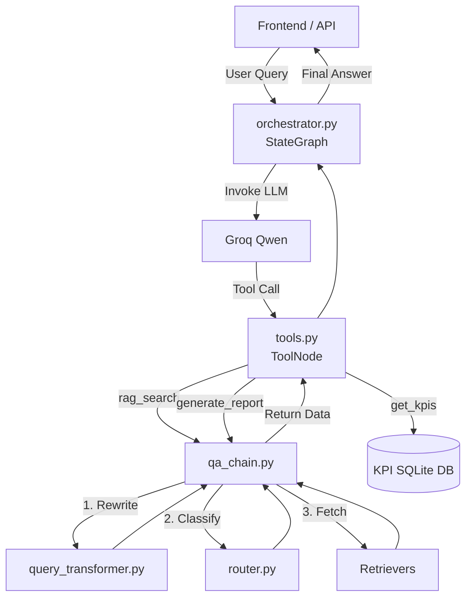

# AURA Agentic Orchestration Analysis

Based on your exact definition of agentic orchestration, I have performed a deep dive into the `src/` directory. I've categorized the files, documented their behavior, and constructed a reading guide to help you master the orchestration layer of AURA.

## 1. Core Orchestration Files
*Files that directly define the graph, nodes, state, routing, or workflow execution.*

### `src/agents/orchestrator.py`
- **Category:** Core Orchestration
- **Short Purpose:** The central nervous system of AURA. Defines the LangGraph state machine, binds tools to the LLM, and manages short-term memory (checkpointer).
- **Key Functions/Classes:** `AgentState`, `chatbot_node`, `create_agent_graph`, `route_tools`, `filter_messages_for_llm`, `run_agent_query`.
- **Why it is Agentic Orchestration:** It explicitly instantiates the `StateGraph`, defines the conditional edges (`route_tools`), and compiles the graph with `MemorySaver`. It is the definitive "what happens next" decision engine.
- **Depends On:** `src.agents.tools`, `langgraph`, `langchain_groq`
- **Depended On By:** `src/api/server.py`
- **Study Strategy:** **Line-by-line.** You must understand exactly how `filter_messages_for_llm` prunes history, and how `route_tools` detects if the LLM invoked a tool.

## 2. Agent Logic Files
*Files that define agents, prompts, planners, verifiers, supervisors, tool-using components, or decision-making behavior.*

### `src/agents/tools.py`
- **Category:** Agent Logic
- **Short Purpose:** Defines the precise tools the LLM can call, encapsulating fallback/retry loops and multi-step logic.
- **Key Functions/Classes:** `@tool rag_search`, `@tool get_kpis`, `@tool generate_report_sections`.
- **Why it is Agentic Orchestration:** It contains the prompt instructions that govern the LLM's tool-calling behavior (e.g., instructing the agent to retry with different parameters if data is missing, or to chain multiple queries in `generate_report_sections`).
- **Depends On:** `src.generation.qa_chain`, `src.extraction.schema`, `src.retrieval.vector_store`.
- **Depended On By:** `src/agents/orchestrator.py`, `src/api/server.py`
- **Study Strategy:** **Line-by-line.** Focus on the docstrings (which act as system prompts to the agent) and the internal retry/fallback logic.

### `src/retrieval/router.py`
- **Category:** Agent Logic
- **Short Purpose:** Acts as a query classification sub-agent to decide the best retrieval strategy based on intent.
- **Key Functions/Classes:** `QueryRouter`, `route_query`, `route_query_rule_based`.
- **Why it is Agentic Orchestration:** It dynamically decides the workflow path for retrieval (e.g., classifying a query as `multi_entity_risk_analysis` vs `single_entity_financial_metric`) using LLM decision-making.
- **Depends On:** `langchain_groq`.
- **Depended On By:** `src/generation/qa_chain.py`
- **Study Strategy:** **Conceptually.** Understand what strategies are available, but don't obsess over the regex parsing of the LLM JSON output.

### `src/retrieval/query_transformer.py`
- **Category:** Agent Logic
- **Short Purpose:** LLM-powered query rewriting and expansion.
- **Key Functions/Classes:** `QueryTransformer`, `rewrite_query`, `generate_multi_queries`.
- **Why it is Agentic Orchestration:** It alters the trajectory of a user's prompt by rewriting vague follow-ups using chat history, or expanding a query into multiple sub-queries.
- **Depends On:** `langchain_groq`.
- **Depended On By:** `src/generation/qa_chain.py`
- **Study Strategy:** **Conceptually.**

## 3. Supporting Orchestration Files
*Files that are not orchestration themselves but are called by orchestration nodes.*

### `src/generation/qa_chain.py`
- **Category:** Supporting Orchestration
- **Short Purpose:** Executes the complex retrieval and generation pipeline once the agent decides to trigger a RAG search.
- **Key Functions/Classes:** `get_answer`, `get_answer_streaming`.
- **Why it is Supporting:** While it contains massive amounts of logic (RRF fusion, dynamic $K$ scaling, routing invocation), it is fundamentally just a very complex LangChain LCEL wrapper invoked by the `rag_search` tool. It does not control the high-level multi-turn agent state.
- **Depends On:** `src.retrieval.*`, `src.generation.prompts`.
- **Depended On By:** `src/agents/tools.py`
- **Study Strategy:** **Conceptually first.** This file is massive (>1000 lines). Understand the flow (Rewrite -> Route -> Retrieve -> Rerank -> Generate) before reading the exact implementations.

## 4. Pure RAG / Utility Files
*Important, but not agentic orchestration.*

- `src/api/server.py` (FastAPI endpoints)
- `src/retrieval/vector_store.py` (ChromaDB wrapper)
- `src/retrieval/bm25_retriever.py` (Keyword search)
- `src/retrieval/reranker.py` (CrossEncoder logic)
- `src/generation/prompts.py` (Static string definitions)

---

## Recommended Reading Order

If you want to understand the orchestration layer from top to bottom, read the files in this exact sequence:

1. **`src/agents/orchestrator.py`** (The brain / State Machine)
2. **`src/agents/tools.py`** (The hands / Tools available to the brain)
3. **`src/retrieval/router.py`** (The classifier / Decides how to search)
4. **`src/retrieval/query_transformer.py`** (The translator / Fixes human queries)
5. **`src/generation/qa_chain.py`** (The engine / Executes the actual search pipeline)

---

## Orchestration Architecture

---

## LangGraph Concepts Checklist

Before you read `orchestrator.py`, ensure you are confident on these concepts:

- [ ] **State / `TypedDict`**: How the `AgentState` object passes messages between nodes.
- [ ] **Nodes vs. Edges**: The difference between `add_node("chatbot", chatbot_node)` and `add_edge()`.
- [ ] **Conditional Edges**: How `add_conditional_edges` uses a function (`route_tools`) to decide whether to loop to a tool or return to `END`.
- [ ] **`bind_tools()`**: How LangChain models are given JSON schemas of functions to call.
- [ ] **`MemorySaver`**: How LangGraph persists thread history using checkpoints.
- [ ] **Message Types**: The difference between `HumanMessage`, `AIMessage` (with `tool_calls`), and `ToolMessage`.

---

## ⚠️ High-Risk "Black Box" Files

These files contain dense, highly specific logic that you likely relied on AI to generate. Touching them without understanding the consequences will easily break the app.

1. **`src/generation/qa_chain.py`**
   - **Why it's dangerous:** It contains a highly customized multi-entity retrieval algorithm. It manually overrides chunk counts (`k`), uses Reciprocal Rank Fusion (RRF), and does a round-robin allocation to ensure companies are represented equally in the prompt. If you modify the loops here, the RAG will start suffering from "lost in the middle" or entity-starvation issues.
2. **`src/agents/orchestrator.py` (`filter_messages_for_llm`)**
   - **Why it's dangerous:** This function manually iterates over message arrays backwards to prune old tool outputs while keeping the conversational history intact. If this logic breaks, you will hit context window limits instantly, or the agent will hallucinate tool calls based on old data.

---

## Final Summary

**"Which exact files should I open first if I want to understand AURA’s agentic workflow deeply?"**

Open **`src/agents/orchestrator.py`** and **`src/agents/tools.py`** side-by-side. 
`orchestrator.py` shows you *how* decisions are made (the graph), and `tools.py` shows you *what* actions the agent is allowed to take. Together, they constitute 90% of the actual "agentic" behavior in your project.
