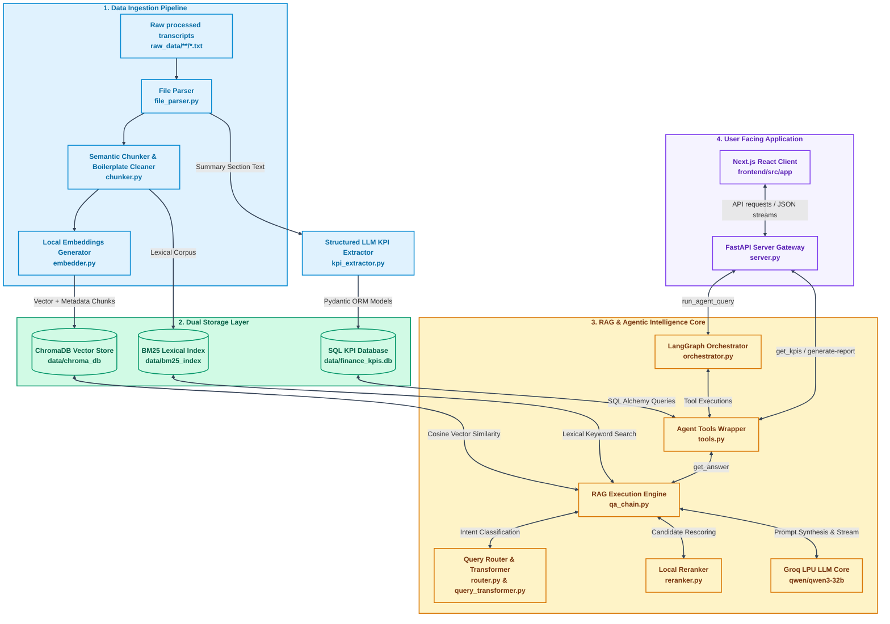
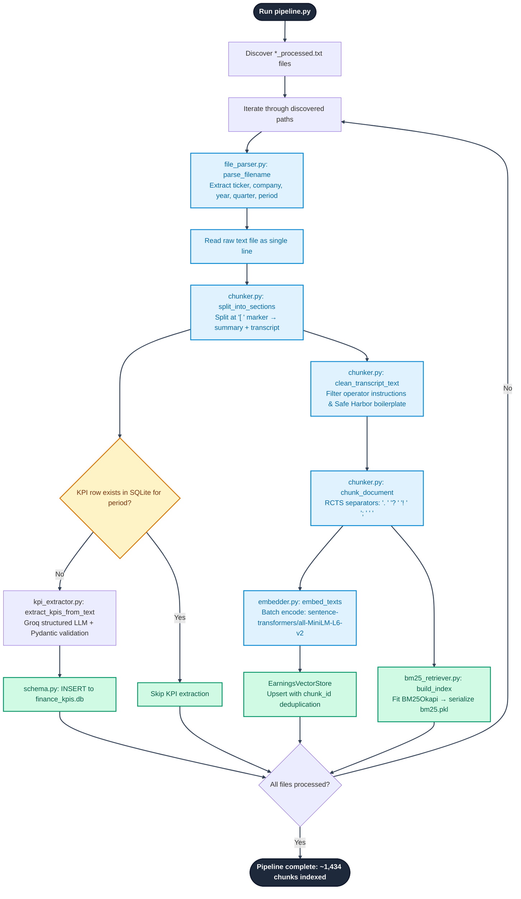
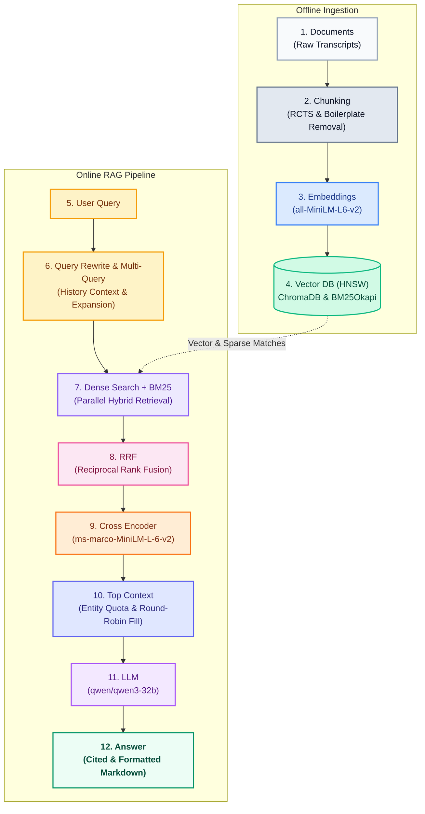
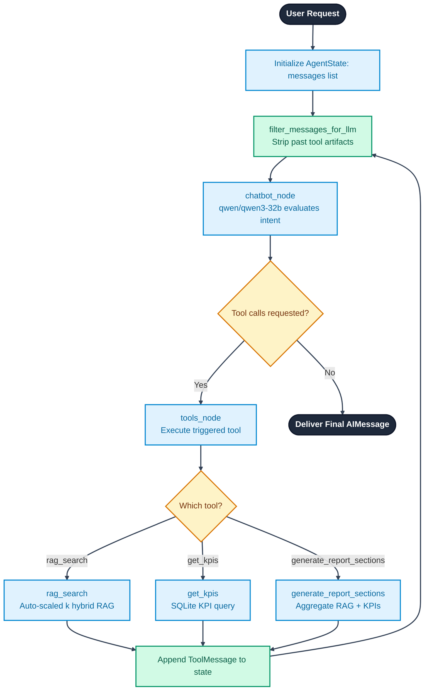

# AURA — Financial Earnings Intelligence Platform
## Master Architecture Walkthrough

> Last updated: Phase 7 — RAG Quality & Multi-Entity Intelligence  
> Coverage: Apple (AAPL), Microsoft (MSFT), Nvidia (NVDA) | Q1 2023 – Q4 2024

---

## Table of Contents

1. [System Ecosystem Overview](#1-system-ecosystem-overview)
2. [Data Ingestion Pipeline](#2-data-ingestion-pipeline)
3. [Dual-Storage Indexing Layer](#3-dual-storage-indexing-layer)
4. [Hybrid Retrieval & Reranking Engine](#4-hybrid-retrieval--reranking-engine)
5. [LangGraph Agent Orchestrator](#5-langgraph-agent-orchestrator)
6. [FastAPI Gateway](#6-fastapi-gateway)
7. [Premium Next.js Cockpit UI](#7-premium-nextjs-cockpit-ui)
8. [Containerized Deployment (Docker)](#8-containerized-deployment-docker)
9. [Phase Changelog](#9-phase-changelog)
10. [Complete Module Reference](#10-complete-module-reference)

---

## 1. System Ecosystem Overview

AURA is a four-layer system: raw transcript files feed a dual-index storage engine, which is queried by a hybrid RAG retrieval engine, orchestrated by a LangGraph state-machine agent, and served via a FastAPI + Next.js application.



---

## 2. Data Ingestion Pipeline

The ingestion pipeline handles a challenging raw format: transcripts are stored as **single massive lines** (40–60 KB, no newlines). Standard text splitters fail on this format.



### Chunking Strategy

```
Raw file (single line, ~50KB)
    ↓  split at "[ " section marker
┌──────────────────┐  ┌────────────────────────────────┐
│  Summary Section │  │  Transcript Section (Q&A)       │
│  (management     │  │  (live earnings call dialogue)  │
│   prepared       │  └────────────────────────────────┘
│   remarks)       │
└──────────────────┘
    ↓  apply RCTS with sentence-priority separators
    ". " → "? " → "! " → "; " → " " → ""
    chunk_size=1000 chars, overlap=200 chars
    ↓
Individual semantic chunks
    + metadata: {company, ticker, year, quarter, section, chunk_id}
```

### Index Statistics

| Index | Location | Size |
|---|---|---|
| ChromaDB vectors | `data/chroma_db/` | ~1,434 chunks, 384-dim embeddings |
| BM25 index | `data/bm25_index/bm25.pkl` | Serialized BM25Okapi corpus |
| SQLite KPIs | `data/finance_kpis.db` | Structured metrics per company/quarter |

---

## 3. Dual-Storage Indexing Layer

| Store | Technology | Strengths |
|---|---|---|
| ChromaDB Vector Store | `all-MiniLM-L6-v2` (384-dim cosine) | Semantic intent, synonym matching, conceptual similarity |
| BM25 Lexical Index | BM25Okapi | Exact ticker symbols, metric names, numeric values |
| SQLite KPI Database | SQLAlchemy ORM | Precise reported numbers: Revenue, EPS, Gross Margin, Guidance |

---

## 4. Hybrid Retrieval & Reranking Engine

```mermaid
flowchart TD
    classDef start_end fill:#1e293b,stroke:#0f172a,stroke-width:2px,color:#ffffff,font-weight:bold
    classDef process fill:#e0f2fe,stroke:#0288d1,stroke-width:2px,color:#0369a1
    classDef decision fill:#fef3c7,stroke:#d97706,stroke-width:2px,color:#78350f
    classDef storage fill:#d1fae5,stroke:#059669,stroke-width:2px,color:#065f46

    Start([Receive Query & Context Filters]) --> RewriteCheck{Chat history exists?}

    RewriteCheck -->|Yes| QueryRewrite[query_transformer.py: rewrite_query<br/>Resolve pronouns & temporal intent]
    RewriteCheck -->|No| UseOriginal[Use raw query]

    QueryRewrite --> Route[router.py: QueryRouter<br/>Classify strategy & retrieval mode]
    UseOriginal --> Route

    Route --> StrategyBranch{Selected Strategy?}

    StrategyBranch -->|comparison_query| SQLPath[Fetch KPIs from SQLite]
    StrategyBranch -->|RAG paths| MultiCheck{Multiple companies targeted?}

    SQLPath --> SQLAssemble[Synthesize metrics into Markdown]

    MultiCheck -->|No| SingleQuery[Standard Hybrid Retrieval<br/>Vector + BM25 candidates]
    SingleQuery --> Fusion[hybrid_retriever.py: RRF<br/>score = Σ 1/(60 + rank)]
    Fusion --> Rerank[reranker.py: Cross-Encoder<br/>ms-marco-MiniLM-L-6-v2]
    Rerank --> SliceTop[Slice top-k scored docs]

    MultiCheck -->|Yes| MultiBuffer[Per-entity 3× buffer retrieval<br/>k_per_entity = exact × 3]
    MultiBuffer --> MultiRerank[Cross-Encoder per entity pool]
    MultiRerank --> QuotaFill[Strict quota: k // n_entities per company]
    QuotaFill --> RoundRobin[Round-robin overflow fill]
    RoundRobin --> GroupSort[Entity-grouped context ordering<br/>Apple → MSFT → Nvidia]

    SliceTop --> Assemble[Assemble context + format citations]
    GroupSort --> Assemble

    Assemble --> LLMGen[qwen/qwen3-32b<br/>temperature=0.0]

    LLMGen --> StreamParse[Filter think tags & normalize USD]
    StreamParse --> Response([Deliver Answer & Source Citations])
    SQLAssemble --> Response

    class Start,Response start_end
    class RewriteCheck,StrategyBranch,MultiCheck decision
    class QueryRewrite,UseOriginal,Route process
    class SQLPath storage
    class MultiBuffer,MultiQuery,SingleQuery,Fusion,Rerank,MultiRerank,QuotaFill,RoundRobin,GroupSort,SliceTop,Assemble,SQLAssemble,LLMGen,StreamParse process
    linkStyle default stroke:#334155,stroke-width:2px
```

### Query Router — 9 Strategies

| Strategy | Trigger Signals | Mode |
|---|---|---|
| `multi_entity_risk_analysis` | risk terms + multi-company | `rerank` |
| `multi_entity_retrieval` | "all companies", "compare" | `rerank` |
| `single_entity_risk_analysis` | risk terms, one company | `rerank` |
| `single_entity_financial_summary` | summarize + financial terms | `rerank` |
| `single_entity_financial_metric` | specific KPI, one company | `rerank` |
| `comparison_query` | compare/vs/trend | `sql` |
| `exact_fact_query` | product/executive names | `rerank` |
| `summary_section` | "summarize this call" | `vector` |
| `vector_only` | broad qualitative questions | `rerank` |

### Multi-Entity Quota Algorithm (Phase 7)

The reranker is deterministic — it scores what it receives. If Apple chunks dominate the shared pool, the reranker correctly scores them highest. The fix is upstream:

```python
# Step 1: Per-entity 3× buffer retrieval
k_per_entity = max(8, exact_per_entity * 3)

# Step 2: First-pass strict quota allocation
exact_per_entity = k // n_companies
for entity in companies:
    source_docs.extend(reranked[entity][:exact_per_entity])

# Step 3: Round-robin overflow fill
rr_idx = 0
while added < remaining_budget:
    ent = entities_list[rr_idx % len(entities_list)]
    if entity_overflow_pools[ent]:
        source_docs.append(entity_overflow_pools[ent].pop(0))
        added += 1
    rr_idx += 1

# Step 4: Entity-grouped ordering (combats LLM primacy bias)
source_docs = [d for e in companies for d in source_docs if d.metadata['company'] == e]
```

### Comprehensive RAG Pipeline Map
To visualize how the entire pipeline connects from ingestion through hybrid retrieval down to generation:



---

## 5. LangGraph Agent Orchestrator



### Session Memory Architecture

- **Checkpointer**: LangGraph `MemorySaver` persists full message threads per `thread_id`
- **Thread ID**: UUID generated client-side in React; passed with every API request
- **History Filtering**: `filter_messages_for_llm()` strips old `ToolMessage` blocks before each LLM call — forces fresh tool invocations, prevents stale-data hallucinations

---

## 6. FastAPI Gateway

| Endpoint | Method | Purpose |
|---|---|---|
| `/` | GET | Health check — returns `{"status": "ok"}` |
| `/api/chat` | POST | Run agent query; returns `{message, sources}` |
| `/api/kpis` | GET | Direct KPI database query for analytics dashboard |
| `/api/generate-report` | POST | Full investment brief generation |

**System Instruction Layer**: Every `/api/chat` request prepends a comprehensive system instruction to the user query covering: response length scaling, citation preservation, multi-entity equal coverage, comparison table generation, and table-safe citation format.

---

## 7. Premium Next.js Cockpit UI

### Three-Panel Interface

**Intelligence Chat Tab**
- Animated sun icon (idle: 8s spin; active: 3s spin + pulse ring)
- Response Richness slider (1–30) → controls backend `top-k` parameter
- Persistent query history in localStorage
- AI responses rendered via `react-markdown` + `remark-gfm` with full table support
- Source citation bubble tooltips on hover
- Agent pipeline progress stepper during response generation

**KPI Analytics Tab**
- Company selector → real-time SQLite query
- Grid of quarterly metric cards: Revenue, EPS, Gross Margin, Net Income, Guidance Range
- YoY growth chevron indicators (↑ green / ↓ red)

**Intelligence Brief Tab**
- Company/Year/Quarter parameter selectors
- Synthesis pipeline stepper with 4 live progress steps
- Full investment research brief rendered in markdown viewport

### Design System

- **Background**: Deep navy `#0A0F1E` with layered radial glows + 50px grid overlay
- **Primary accent**: Vibrant emerald mint `#00F5A0`
- **AI accent**: Purple `#8B5CF6`
- **Cards**: Glassmorphism — `backdrop-filter: blur(20px)` + mint glow on hover
- **Typography**: Inter (UI) + Plus Jakarta Sans (display headings)

---

## 8. Containerized Deployment (Docker)

**Services:**
- `backend`: Python FastAPI server — `python:3.11-slim` + C++ build tools for ChromaDB compilation
- `frontend`: Next.js — multi-stage build (builder + lightweight runner)

**Key configurations:**
- `./data:/app/data` volume — persists ChromaDB, BM25, SQLite across rebuilds
- `env_file: config/.env` — Groq API key injected at runtime, never baked into image
- Internal DNS — frontend uses `http://backend:8000` for inter-service calls

```bash
docker compose up --build     # First build (~15 min due to PyTorch download)
docker compose up             # Subsequent starts (<10 sec, layer cache)
```

---

## 9. Phase Changelog

| Phase | Focus | Key Deliverables |
|---|---|---|
| **1** | RAG Foundation | ChromaDB pipeline, Qwen3 integration, `<think>` token filter, Streamlit UI |
| **2** | Hybrid Retrieval | BM25, RRF fusion, Cross-Encoder reranker, boilerplate filter, entity starvation fix |
| **3** | KPI Extraction | Groq structured output, Pydantic ORM, SQLite schema, KPI dashboard |
| **4** | Agent Orchestration | LangGraph state machine, tool definitions, `MemorySaver`, multi-turn context filter |
| **5** | Premium Frontend | Next.js cockpit, suggestion chips, query history, citation bubbles, KPI gauge cards, agent stepper, Response Richness slider |
| **6** | Dockerization | Multi-stage Docker builds, Docker Compose bridge networking, volume persistence, WSL2 VHDX compaction |
| **7** | RAG Quality | 3× retrieval buffer, round-robin overflow, entity-grouped context, table citation safety, dual-layer prompt enforcement, agent auto-scaling k |

---

## 10. Complete Module Reference

```
Finance_RAG_Project/
├── src/
│   ├── ingestion/
│   │   ├── file_parser.py        — Regex filename parser (ticker, company, period)
│   │   ├── chunker.py            — 2-step RCTS chunker + boilerplate cleaner
│   │   ├── embedder.py           — Singleton all-MiniLM-L6-v2 embedding wrapper
│   │   └── pipeline.py           — Main ingestion coordinator
│   ├── retrieval/
│   │   ├── vector_store.py       — ChromaDB cosine similarity queries + filters
│   │   ├── bm25_retriever.py     — BM25Okapi sparse index + pkl serialization
│   │   ├── hybrid_retriever.py   — Reciprocal Rank Fusion engine
│   │   ├── reranker.py           — Cross-Encoder ms-marco-MiniLM-L-6-v2 wrapper
│   │   ├── router.py             — 9-strategy query intent classifier
│   │   └── query_transformer.py  — Multi-turn query rewriter
│   ├── generation/
│   │   ├── prompts.py            — SYSTEM_PROMPT, RAG_QA_PROMPT, citation helpers
│   │   └── qa_chain.py           — Core RAG orchestrator: RRF→rerank→quota→generate
│   ├── extraction/
│   │   ├── schema.py             — SQLAlchemy EarningsKPI ORM model
│   │   └── kpi_extractor.py      — Groq structured LLM KPI extractor
│   ├── agents/
│   │   ├── tools.py              — rag_search, get_kpis, generate_report_sections tools
│   │   └── orchestrator.py       — LangGraph graph + MemorySaver compilation
│   └── api/
│       └── server.py             — FastAPI endpoints + system instruction layer
├── frontend/
│   └── src/app/
│       ├── page.tsx              — Main application: Chat, KPI, Brief panels
│       ├── layout.tsx            — Font config + HTML metadata
│       └── globals.css           — Complete design system: tokens, components, animations
├── docs/                         — Detailed technical documentation
│   ├── architecture.md           — System design overview
│   ├── retrieval_engine.md       — RAG retrieval deep-dive
│   ├── agent_orchestration.md    — LangGraph agent reference
│   ├── frontend.md               — UI component documentation
│   ├── deployment.md             — Setup & deployment guide
│   └── engineering_challenges.md — All-phases challenge log
├── features_and_learnings/       — Per-phase challenge & learning documents
│   ├── Phase_1challenges_and_learnings.md
│   ├── phase2_challenges_and_solutions.md
│   ├── phase3_4__challenges_and_resolutions.md
│   ├── phase5_challenges_and_solutions.md
│   ├── phase6_challenges_and_solutions.md
│   └── phase7_challenges_and_solutions.md
├── config/
│   ├── config.yaml               — System dimensions, models, paths, thresholds
│   └── .env                      — GROQ_API_KEY (gitignored)
├── data/                         — Generated at ingestion time (gitignored)
│   ├── chroma_db/                — ChromaDB vector store
│   ├── bm25_index/               — Serialized BM25 corpus
│   └── finance_kpis.db           — SQLite KPI database
├── backend.Dockerfile            — Python backend container
├── docker-compose.yml            — Full-stack orchestration
└── requirements.txt              — Python backend dependencies
```
